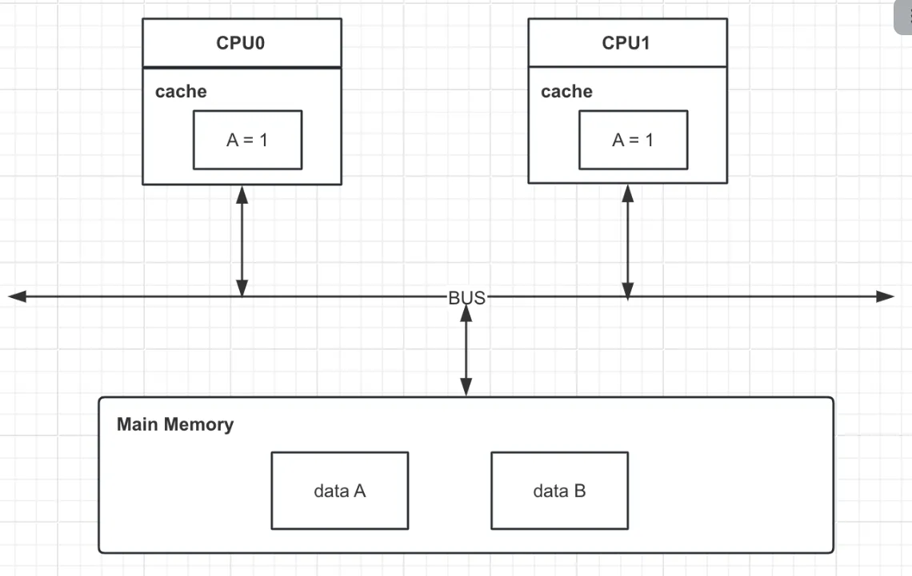
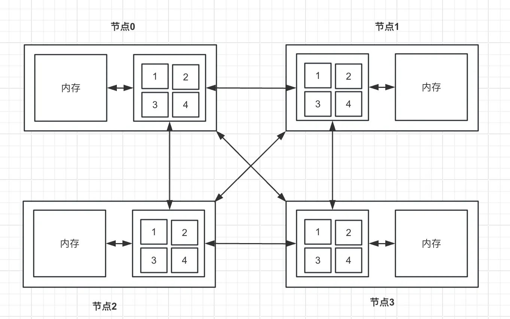
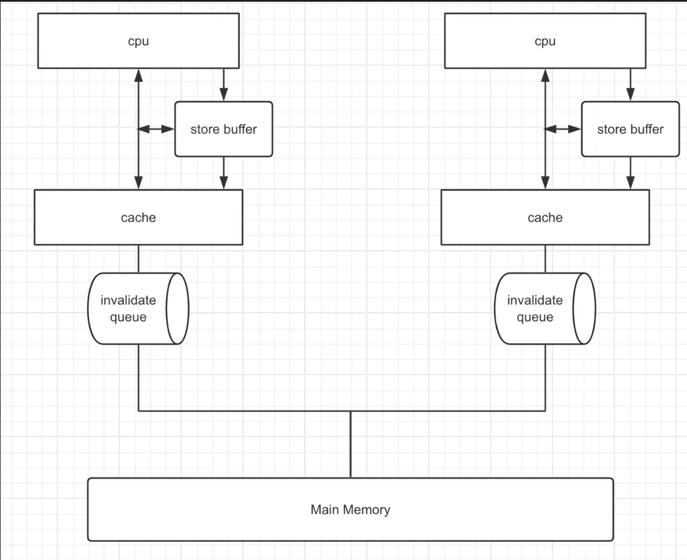

# Java多线程总结（一）：系统理论基础

<!-- more -->

## 一、Java多线程发展历史
Java多线程的发展可以简单从几个较为关键的点来介绍：
●  Java1.5之前： 
  ○ 提供基础的多线程支持，包括Thread和Runnable接口
  ○ 提供最初的synchronized配合wait()、notify()、notifyAll()的线程同步机制
●  Java1.5： 
  ○ 引入了J.U.C，并配套有了大量的并发工具，
  ○ 引入了Future和Callable，处理异步返回值的问题
  ○ 完善volatile语义
●  Java1.6：synchronized体系知耻而后勇，迎来传说中的“锁升级” 
●  Java1.7：引入Fork/Join框架 
●  Java1.8：CompletableFuture携流式API登场，提供的更为丰富的异步编程处理模型 
●  Java1.9及之后：值得一提的就是Java19的虚拟线程 

## 二、缓存一致性
### 2.1 两种CPU架构
SMP

SMP(symmetrical multi-processing, 对称多处理器技术)，在一个计算机上集成多个CPU，各个CPU之间共享内存子系统及总线系统。在任务调度时，系统将任务对称地分布在多个CPU上，所有处理器平等访问内存、IO和外部中断，提高了系统的批处理能力，但同时因为内存共享也带来了高速缓存一致性的问题。缓存一致性的问题通常需要硬件支持，会有硬件性能损耗，并且随着CPU数量的增加而增加，比如一个96核的服务器，每个CPU运行一个线程，每个线程访问同一个变量V，当其中一个线程对V做出修改时，会把消息广播到其余的CPU上，这会造成极大的硬件性能损耗，所以SMP技术很难组件大规模的CPU系统。

NUMA



SMP在扩展能力上有一定限制，针对这一问题的探索成果之一就是NUMA（non-uniform memory access，非一致性内存访问）。
在NUMA架构中，一台服务器有多个节点，每个节点有多个CPU，每个节点有自己的内存，节点可以访问自己的内存（近端内存）和其余节点的内存（远端内存）。CPU和近端内存之间通过片内总线连接，节点之间通过互联模块通信。在NUMA架构中，远端内存的访问速度通常为近端内存的20%-77%

还有诸多其余的CPU架构，不再列举。
SMP优势是访问内存速度快，但是扩展性不足，NUMA则与之相反，远端内存的访问速度较低，但是扩展性优秀。
目前，应用服务器大都基于SMP架构设计的，而大规模的数据存储服务器则是基于NUMA架构设计的。在这里我们主要基于SMP架构


### 2.2 MESI协议
目前来讲，大多数CPU都配备不同层级的缓存(L1-L4等)，越高级的缓存性能越强，且更趋向于CPU独享，不难理解缓存一致性问题出现的原因。为解决这一问题，有了各种缓存一致性协议。不同CPU类型支持的缓存一致性协议是不同的，比如有MSI、MESI、MOSI、MESIF等，其中最常用的是MESI协议及其扩展

缓存一致性协议大致可分为两种策略：
● 写失效：
  ○ 当一个处理器写入数据时，它会发送一个失效信号到其他处理器，使得其他处理器的缓存中相应的数据副本被标记为无效。
  ○ 这种方法可以减少总线上的流量，因为只有在数据被写入时才需要通信。
  ○ 但是，如果有多个处理器频繁读写同一数据，可能会导致较高的失效和缓存一致性维护开销。
● 写更新：
  ○ 当一个处理器写入数据时，它会发送更新的数据值到所有其他处理器，使得它们的缓存副本也被更新。
  ○ 这种方法可以减少因数据失效导致的缓存未命中率，特别是在多个处理器共享读取同一数据的情况下。
  ○ 然而，这可能导致总线上的流量增加，因为每次写操作都需要通知其他所有处理器。

写失效在一致性协议中更为常见，接下来我们要讨论的MESI就是一种写失效协议

MESI分别代表了四种数据状态：
● M（Modify）：表示数据只存在于当前缓存，并且已经被修改，与主存内数据不一致
● E（Exclusive）：表示数据只存在于当前缓存，并且没有被修改
● S（Shared）：表示数据存在于多个缓存，数据与主存保持一致
● I（Invalid）：表示数据失效

四种状态会基于CPU对数据的操作而发生变更，为了维护状态的准确性，所以有了一些必要的监听机制，如
● 如果一个缓存行处于M状态，则它必须监听所有试图获取该缓存行对应的主存地址的操作，并且在操作执行前将缓存数据写回主存
● 如果一个缓存行处于E状态，则它必须监听所有试图获取该缓存行对应的主存地址的操作，一旦有这种操作，需要将当前缓存行的状态设置为S
● 如果一个缓存行处于S状态，则它需要监听其余的“对该缓存行设置Invalid”和“对该缓存行设置Exclusive的操作”，一旦有这种操作，需要将该缓存行状态设置为Invalid
● 等等等等

#### 2.2.1 嗅探协议
> 嗅探协议是一种用于维护多处理器系统中缓存一致性的协议。这种协议在基于共享总线的系统中非常有效，因为每个处理器的缓存都可以监听（"嗅探"）总线上的流量来检测其他缓存所做的读写操作。
 
在使用 Snoopy 协议的系统中，当一个处理器执行读或写操作时，该操作会在总线上广播。其他处理器的缓存控制器会“嗅探”这些操作，并根据它们对共享数据的操作来更新自己的缓存状态。例如，如果一个处理器写入了一个共享变量，其他处理器的缓存中相应的缓存行可能会被标记为无效（invalid），以确保缓存一致性。
 
Snoopy 协议通常与缓存一致性协议（如 MESI 协议）结合使用,过程中涉及到的一些消息类型和对应的描述如下：
| 消息名                  | 消息类型 | 描述                                                                                   |
|-------------------------|----------|----------------------------------------------------------------------------------------|
| Read                    | 请求     | 该消息包含要读取的Cache Line的物理地址，即告知其余处理器，当前处理器准备读取数据       |
| Read Response           | 响应     | 该消息包含Read请求中想要读取的数据，该消息可能来自于主存，可能来自于其余处理器，取决于当前缓存行的状态 |
| Invalidate              | 请求     | 通知其余处理器将对应缓存行数据设置invalid状态，即失效缓存                             |
| Invalidate Acknowledge  | 响应     | 当CPU收到invalidate消息时，需要回复该指令，表示自己的缓存行数据已经失效               |
| Read Invalidate         | 请求     | 该消息是一个复合操作，告知其余处理机，当前处理机将读取一个数据，并且进行修改操作，希望其余处理器失效对应的缓存行数据。发送该消息的处理器期望收到一个Read Response和多个Invalidate Acknowledge |
| Writeback               | 请求     | 该消息包含需要写回主存的数据及对应的主存                                               |
|...|||


#### 2.2.2 Store Buffer与Invalidate queue
我们注意到，嗅探协议中很多消息都是需要响应的，于是CPU层面就遇到了和应用层面相类似的场景：同步等待响应的过程阻塞了CPU操作，影响了整体的性能。在解决方法上，CPU层面和业务应用层面也是类似的，即同步改异步，于是就有了 **Store Buffer** ，它相当于一个暂存数据，有了它之后，CPU发出对应的指令后，不再同步等待响应，而是先把数据写入StoreBuffer，之后继续执行后面的指令，之后择机将StoreBuffer的数据刷回缓存行。

但是显然只有StoreBuffer是不行的，按照上面描述的情况，相当于写操作的时候写入了StoreBuffer，但是数据的时候依然是从缓存行读，那么读就有可能读到脏数据，比如下面这个简单的例子

```
//初始a = 0，是一个shared状态
a = 1;
b = a+1;
assert(b == 2)
```

正常来讲，代码中的assert一定为true，但是a = 1这个操作会进入StoreBuffer，之后b = a + 1中从缓存行中读到的a是0，这就导致了assert失败。针对这个问题，我们首先想到的会是提高StoreBuffer在读时候的优先级，先读StoreBuffer再读缓存行，CPU也确实采用了这个机制，被称为**Store Forwarding**，可惜的是，即便有了StoreForwarding，多核在运行时依然会有问题，再看下面这个例子
```
int a = 0, b = 0;

executeToCPU0(){
	a = 1;
	b = 1;
}

executeToCPU1(){
	while(b == 1){
		assert(a == 1)
	}
}
```

executeToCPU0在CPU0上执行，executeToCPU1在CPU1上执行。正常来讲，b==1后a必然为1，也就是说断言会成功，但是在我们目前描述的这些机制下，断言依然会失败。推演一下步骤：
1. CPU0执行a = 1，a不存在于CPU0的缓存中，此时发送一个read invalidate消息，希望得到a的值，并且希望其余CPU对应的a缓存失效
2. CPU0执行b = 1，b存在于缓存行中，处于modify或者exclusive状态，于是直接更新缓存行b=1
3. CPU1执行while，b不存在于缓存中，于是发送一个read invalidate消息
4. CPU0响应CPU1对b的消息，返回b = 1
5. CPU1继续执行assert语句，a存在于CPU1的缓存行中且等于0，于是此时断言失败
6. CPU1收到CPU0对a的read invalidate消息，此时才返回a=0，并且失效自己的缓存，但是可见性问题已经发生了

可以发现，上述问题的核心还是可见性问题，a的写操作无法即时同步给其余处理器，导致结果看起来像是执行乱序了，仿佛是按下面的顺序执行的
```
executeToCPU0(){
	b = 1;
	a = 1;
}
```

至此，我们知道的StoreBuffer在提升性能的同时引入了可见性问题，导致CPU操作的指令重排，这个问题最终CPU层面的解决方案是内存屏障，关于内存屏障我们之后介绍，现在我们先来看下StoreBuffer导致的另一个问题。
StoreBuffer本身容量非常小，容易被打满，里面的数据只能是在接到ACK之后才能清除，而接收方处理器因为运行状况等原因，无法对ACK的时间作出保证。针对这个问题，CPU在响应ACK时也增加了一个异步处理，即增加了一个InvalidateQueue，对于invalidate操作，先响应再处理，以确保StoreBuffer中等待ACK的数据不会过多。


和StoreBuffer类似的是，InvalidateQueue的引入在解决性能问题的同时，也引入了可见性问题，会导致指令重排。依然看这个例子：
```
int a = 0, b = 0;

executeToCPU0(){
	a = 1;
	b = 1;
}

executeToCPU1(){
	while(b == 1){
		assert(a == 1)
	}
}
```
和之前执行步骤不同的是，这次对于a的invalidate操作已经被CPU1处理，但是它放在了InvalidateQueue当中并未及时生效，因此导致了断言失败。
我们发现，上面描述的两种问题都是因为StoreBuffer或InvalidateQueue的数据没有及时生效，而CPU针对这些情况并没有再进行一些强制的保障，而是提供了内存屏障，将具体的控制器交给开发者

### 2.3 内存屏障
大多数处理器都会提供一下几种内存屏障，以X86为例：
● 读屏障（lfence, load fence）：将invalidate queue中的指令立即处理，并且强制读取缓存行。执行ifence指令之后的操作不会被排到执行ifence之前。这意味着其余CPU暴露出来的缓存行状态对当前CPU可见。（一定要读最新值）
● 写屏障（sfence, store fence）：将Store buffer中的数据修改刷新到本地缓存中，使得其它CPU能看到这些修改。执行sfence之后操作不会被排到执行sfence之前，这意味着执行sfence之前的操作一定全局可见。（写的最新值一定要让所有人都知道）
● 读写屏障（mfence, memeory fence）：相当于ifence和sfence的混合，保证顺序及可见
此外，Lock指令用来修饰操作符，保证原子性，它具有mfence的效果。也就是说任何一个指令搭配上Lock前缀都有内存屏障的效果。在常见的X86架构下，常常使用Lock加一个空操作来实现内存屏障。

:::tip
读写屏障的功能可以这么记忆：
- 读屏障：我想要的是读到最新的数据，我自己写的我肯定能读到，而我这里和别人的写操作相关的就是invalidateQueue，所有需要刷一把它
- 写屏障：我想要的是我写完之后大家都能读到最新的，但我管不了其他人，我只能保证我写完之后你再来问我，我一定给到你最新的。我最新的写操作可能在storeBuffer里面，但是你没法读，所有我刷回内存给你读
:::

不同的操作系统会封装不同的方法来对CPU的内存屏障指令进行调用，比如Linux中基于汇编宏命令构建了三种基础的内存屏障：
```
// :::"memory" 是 GCC 内联汇编的一种语法，用于告诉编译器这段汇编代码可能会影响内存，
// 因此编译器应该假设所有缓存的内存值都是无效的，并在需要时重新加载它们。
// 编译器决定具体该怎么做，可能会使用lfence、mfence、sfence
#define lfence() __asm__ __volatile__("mfence" ::: "memory");
#define sfence() __asm__ __volatile__("sfence" ::: "memory");
#define mfence() __asm__ __volatile__("mfence" ::: "memory");
```
