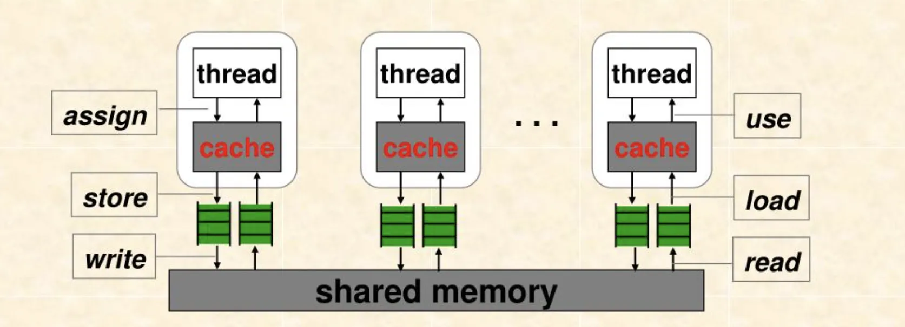
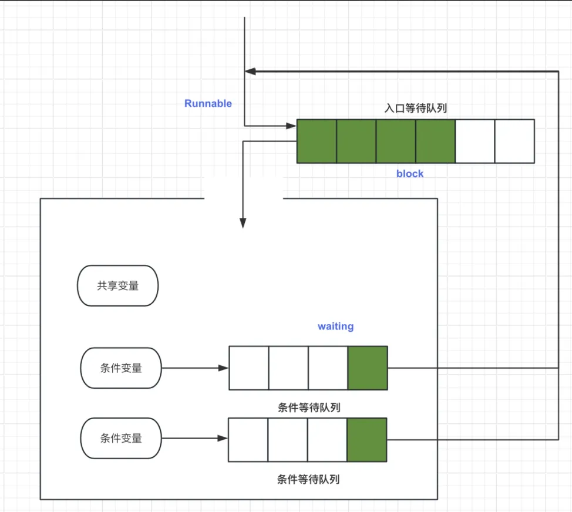
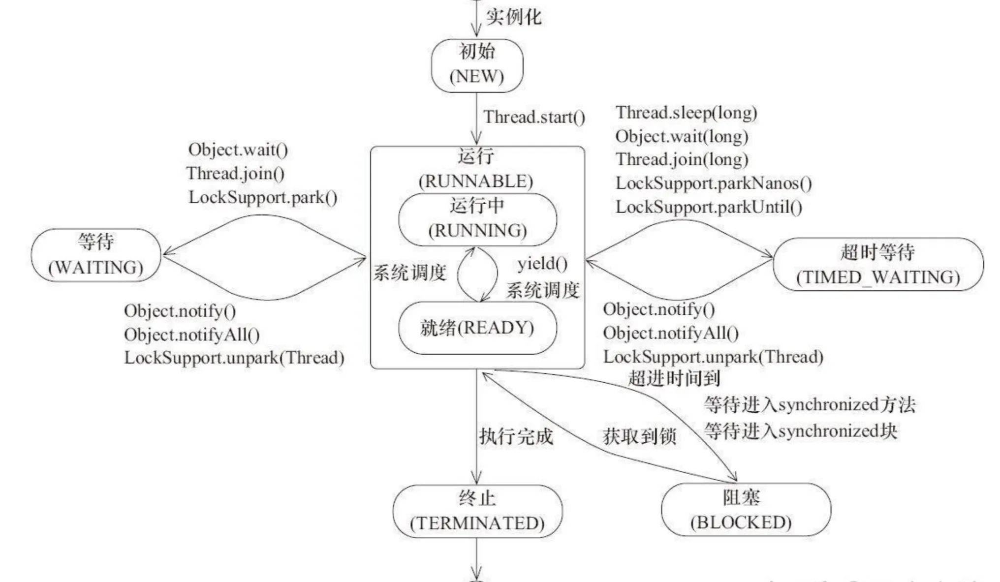
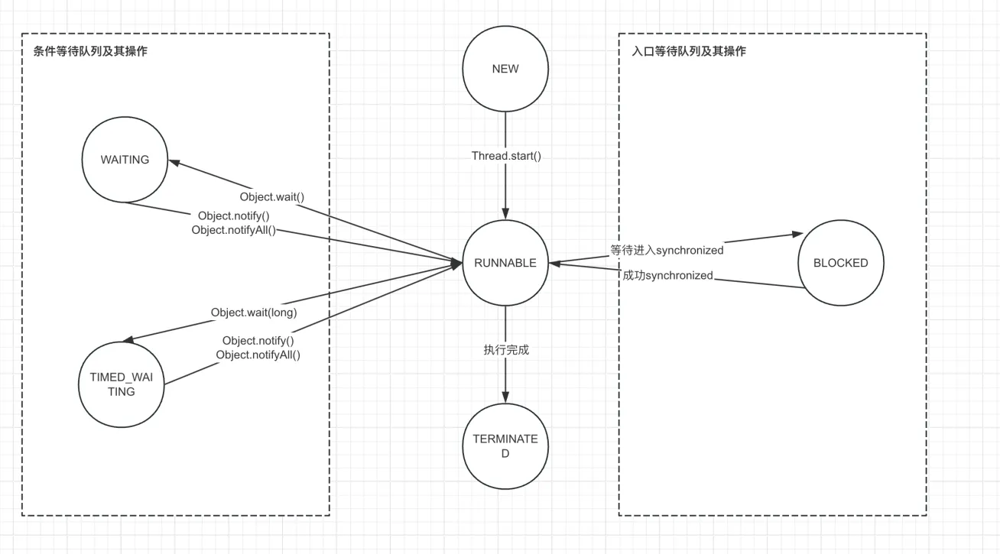
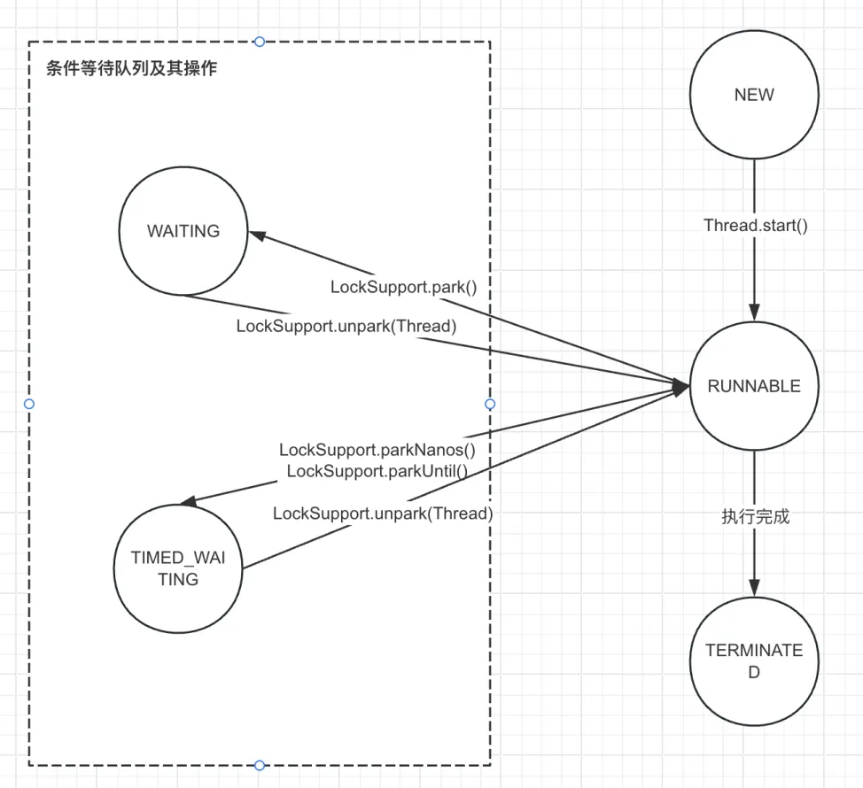
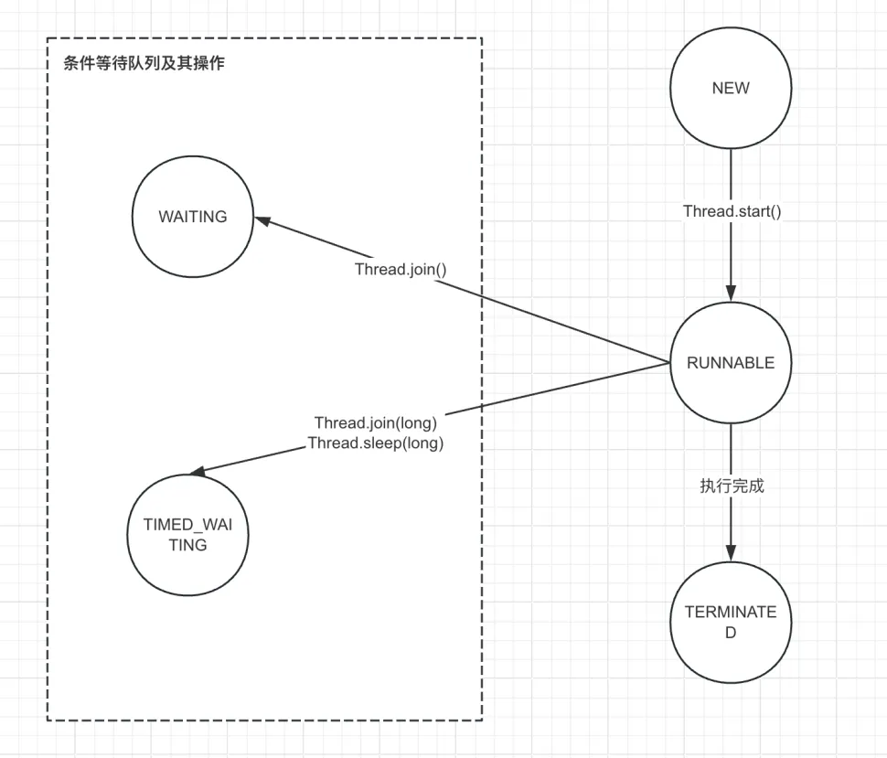

# Java多线程总结（二）：Java理论基础

<!-- more -->


## 一、JMM

不同的操作系统会内存屏障相关的支持和提供的api不同，Java作为跨平台的语言，它提供了JMM的抽象来屏蔽这些差异


结合load与store操作，JVM提供了四种内存屏障
| 屏障类型   | 示例                        | 说明                                           |
|------------|-----------------------------|------------------------------------------------|
| LoadLoad   | Load1；LoadLoad；Load2      | 确保load2访问数据前先加载load1的数据            |
| LoadStore  | Load；LoadStore；Store      | 确保store访问数据前先加载load的数据             |
| StoreStore | Store1；StoreStore；Store2  | 确保store2在store1之后完成                      |
| StoreLoad  | Store；StoreLoad；Load      | 确保load在store完成后进行                       |


OrderAccess中定义了内存屏障
```
class OrderAccess : AllStatic {
 public:
  static void     loadload();
  static void     storestore();
  static void     loadstore();
  static void     storeload();

  static void     acquire();
  static void     release();
  static void     fence();
    
  ......
};
```

因为JVM需要支持跨平台，所有针对不同系统提供了不同实现，以X86架构下的Linux为例(不同版本JDK可能也不同)：
```
inline void OrderAccess::loadload()   { acquire(); }
inline void OrderAccess::storestore() { release(); }
inline void OrderAccess::loadstore()  { acquire(); }
inline void OrderAccess::storeload()  { fence(); }

inline void OrderAccess::acquire() {
  volatile intptr_t local_dummy;
#ifdef AMD64
  __asm__ volatile ("movq 0(%%rsp), %0" : "=r" (local_dummy) : : "memory");
#else
  __asm__ volatile ("movl 0(%%esp),%0" : "=r" (local_dummy) : : "memory");
#endif // AMD64
}

inline void OrderAccess::release() {
  // 我怀疑这里是利用cpp的volatile机制
  volatile jint local_dummy = 0;
}

inline void OrderAccess::fence() {
  if (os::is_MP()) {
    // always use locked addl since mfence is sometimes expensive
#ifdef AMD64
    __asm__ volatile ("lock; addl $0,0(%%rsp)" : : : "cc", "memory");
#else
    __asm__ volatile ("lock; addl $0,0(%%esp)" : : : "cc", "memory");
#endif
  }
}

......
```

可见除了storeload之外都是使用memory提醒编译器重新加载内存，而storeload则是使用了lock
```
// (java 9) hotspot/src/os_cpu/linux_x86/vm/orderAccess_linux_x86.inline.hpp

// A compiler barrier, forcing the C++ compiler to invalidate all memory assumptions
static inline void compiler_barrier() {
  __asm__ volatile ("" : : : "memory");
}
inline void OrderAccess::loadload()   { compiler_barrier(); }
inline void OrderAccess::storestore() { compiler_barrier(); }
inline void OrderAccess::loadstore()  { compiler_barrier(); }
inline void OrderAccess::storeload()  { fence();            }
inline void OrderAccess::acquire()    { compiler_barrier(); }
inline void OrderAccess::release()    { compiler_barrier(); }
inline void OrderAccess::fence() {
  if (os::is_MP()) {
    // always use locked addl since mfence is sometimes expensive
#ifdef AMD64
    __asm__ volatile ("lock; addl $0,0(%%rsp)" : : : "cc", "memory");
#else
    __asm__ volatile ("lock; addl $0,0(%%esp)" : : : "cc", "memory");
#endif
  }
  compiler_barrier();
}
```
### 1.1 Happens-before原则
● 程序顺序原则：在一个线程中，执行顺序按照程序语义顺序（无依赖关系的可以被乱序优化）
● 传递性原则：A->B, B->C ==> A->C
● volatile原则：对volatile变量的写操作与其后续的读操作遵循happens-before原则，即该写操作对后续读可见
● 监视器锁原则：synchronized原则，解锁操作happens-before后续加锁操作
● start原则：在start方法启动线程时，父线程的变更对子线程是可见的
● join原则：A线程等待B线程，当B线程结束时，其修改对于A线程是可见的
● interrupt原则：对线程interrupt的调用happens-before该线程的中断检测
● finalize原则：一个对象的初始化完成happens-before该对象的finalize方法

## 二、管程

### 2.1 MESA管程模型
一般来讲，操作系统会提供互斥量和信号量的同步机制，但是用起来不太方便，于是就有了“管程”这一封装（一般由编程语言提供）。管程指的就是管理共享变量和对共享变量的操作，让它们支持并发。
Java的并发编程参考了MESA管程模型。关于MESA管程模型需要注意的点：
● 同一时刻只允许一个线程进入管程内部对共享变量进行操作
● 有一个入口等待队列，没有获取到入口权限的线程会在入口等待队列中等待
● 管程内部有多个等待条件，当线程在条件变量上等待时，会进入该变量对应的条件等待队列，同时释放掉入口锁权限
  ○ 条件变量也是由管程管理的，在Java中，synchronized的条件变量就是入口锁对象，Lock的条件变量需要通过Lock创建
● 当条件等待队列中的线程被唤醒时，它需要重新获取入口权限（可能重新进入等待队列）
  ○ 在线程重新获取到入口权限，来到之前的上下文继续执行时，对应的条件变量可能又再次不满足了，所以Java并发编程里常见while（条件判断）的样式
● 当线程离开管程时也会释放入口锁


### 2.2 Java对应的管程模型
synchronized是简化的MESA模型，它只有一个等待队列，而且它的条件变量默认就是入口锁对象，所有我们在synchronized块中可以执行notify、wait，如果在synchronized块之外调用这些方法，则会抛出管程状态异常的错误，结合前述可以得知这是因为用法不符合管程规范

Lock对应的是相对完整的MESA模型，它支持了多个条件变量，但需要手动指定

可以通过一个简版的阻塞队列体会Java中管程的执行过程
```java
public class MyBlockingQueue <T>{
     private List<T> list = new LinkedList<>();
     private int capacity;

    public MyBlockingQueue(int capacity){
        this.capacity = capacity;
    }

    //获取入口锁
    public synchronized T take() throws InterruptedException{
        //这里针对的就是从【条件满足被唤醒】到【重新获取锁并来到之前的上下文】这段期间条件变量发生了变化
        while (list.isEmpty()) {
            System.out.println("take wait, size:"+list.size());
            wait();
        }
        T ret = list.remove(0);
        //这里其实有两个条件：full和empty，但是这两个条件互斥，所以在该代码里了一个
        //这里等于nofity-full
        notifyAll();
        return ret;
    }

    public synchronized void put(T t) throws Exception{
        while (list.size() >= capacity) {
            System.out.println("put wait, size:"+list.size());
            wait();
        }

        list.add(t);
        notifyAll();
    }
}
```

### 2.3 从MESA管程角度理解Java线程状态流转

:::tip
我们尝试用管程状态解释Java线程状态变更。上图其实包含三套机制：synchronized机制、Lock机制以及其它
:::

#### 2.3.1 synchronized的线程状态流转

易于理解，处在入口等待队列中的状态为blocked，处在条件等待队列中的状态为wait状态，当线程从条件等待队列中被唤醒使，重新回到runnable状态，在入口开始下一轮的入口权限争夺

#### 2.3.2 Lock机制的线程状态流转
需要注意的是，Lock机制中用AQS的等待队列代替的入口队列，所以在这套机制下没有blocked状态。查看Lock的lock方法和Condition的await方法，发现它们都是调用了LockSupport.park，区别在于入参的对象不同


#### 2.3.3 其它

最后还有join和sleep方法会让线程进入wait状态
```java
public final synchronized void join(long millis)
  throws InterruptedException {
    long base = System.currentTimeMillis();
    long now = 0;

    if (millis < 0) {
        throw new IllegalArgumentException("timeout value is negative");
    }

    if (millis == 0) {
        while (isAlive()) {
            wait(0);
        }
    } else {
        while (isAlive()) {
            long delay = millis - now;
            if (delay <= 0) {
                break;
            }
            wait(delay);
            now = System.currentTimeMillis() - base;
        }
    }
}
```
显然，join方法显示获取了对应线程的对象锁，之后会调用wait方法进入条件等待队列，需要注意的是，线程在执行结束后会自动执行notifyall方法。至于sleep，这个比较特殊，记住就行，sleep会进入超时等待状态，而且不会释放锁