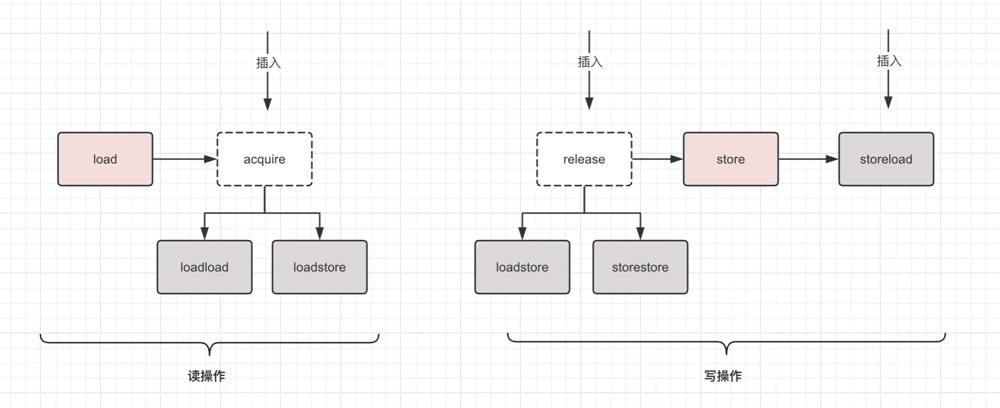
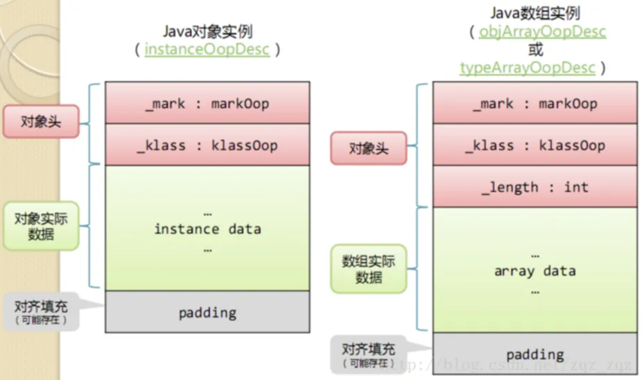
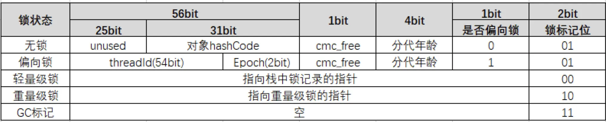
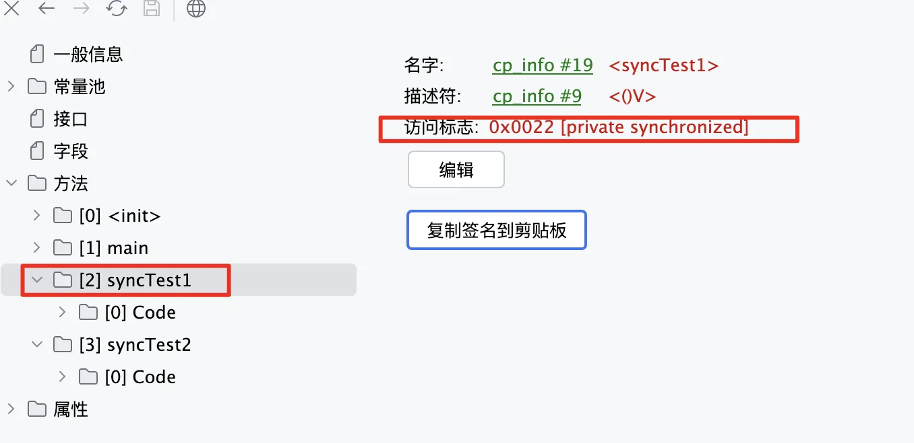

# Java多线程总结（三）：volatile与Synchronized
深入理解volatile与Synchronized的实现原理

<!-- more -->

## 一、volatile
volatile保证的是可见性和有序性
● 有序性：除了编译器优化的指令重排是真正的乱序，其余的乱序执行都是和内存可见性有关
● 可见性：结合之前的缓存一致性与内存屏障，理解volatile与它们是如何结合的
```c
CASE(_getfield):
CASE(_getstatic):
{
  //省略部分代码
  int field_offset = cache->f2_as_index();
  if (cache->is_volatile()) {
    if (support_IRIW_for_not_multiple_copy_atomic_cpu) {
      OrderAccess::fence();
    }
    if (tos_type == atos) {
      VERIFY_OOP(obj->obj_field_acquire(field_offset));
      SET_STACK_OBJECT(obj->obj_field_acquire(field_offset), -1);
    } else if (tos_type == itos) {
      SET_STACK_INT(obj->int_field_acquire(field_offset), -1);
    } else if (tos_type == ltos) {
      SET_STACK_LONG(obj->long_field_acquire(field_offset), 0);
      MORE_STACK(1);
    } 
    //省略部分代码
  } else {
    if (tos_type == atos) {
      VERIFY_OOP(obj->obj_field(field_offset));
      SET_STACK_OBJECT(obj->obj_field(field_offset), -1);
    } else if (tos_type == itos) {
      SET_STACK_INT(obj->int_field(field_offset), -1);
    } else if (tos_type == ltos) {
      SET_STACK_LONG(obj->long_field(field_offset), 0);
      MORE_STACK(1);
    } 
    //省略部分代码
  }
```

对于volatile的读操作，注意到：
● 使用的是xxx_field_acquire而不是xxx_field，进入后看到其调用的是OrderAccess::load_acquire，根据OrderAccess的注释，该命令拆分成load+acquire
  ○ load：即JMM中的load
  ○ acquire：等于loadload+loadstore
可以理解为volatile变量在读之后会加上loadload屏障和loadstore屏障

关于里面的fence：https://jingzhouzhao.github.io/archives/9489a17b.html
```c
CASE(_putfield):
CASE(_putstatic):
{
  //省略部分代码
  int field_offset = cache->f2_as_index();
  if (cache->is_volatile()) {
    if (tos_type == itos) {
      obj->release_int_field_put(field_offset, STACK_INT(-1));
    } else if (tos_type == atos) {
      VERIFY_OOP(STACK_OBJECT(-1));
      obj->release_obj_field_put(field_offset, STACK_OBJECT(-1));
    } 
    //省略部分代码
    OrderAccess::storeload();
  }else {
    if (tos_type == itos) {
      obj->int_field_put(field_offset, STACK_INT(-1));
    } else if (tos_type == atos) {
      VERIFY_OOP(STACK_OBJECT(-1));
      obj->obj_field_put(field_offset, STACK_OBJECT(-1));
    }
    //省略部分代码
  }
```
对于volatile字段的写操作，注意到两点：
● 调用的是release_xx_field_put，而非volatile字段调用的是xx_field_put，进入后发现调用的是release_store方法，同样理解为release+store
  ○ release：loadstore+storestore
  ○ store：即JMM的store
● volatile字段在写之后必然会调用一个storeload屏障

可以理解为volatile变量在写之前加入了loadstore和storestore，在写之后加入了storeload


总结一下：
● volatile字段读调用的是load_acquire，在load之后执行了acquire，相当于读之后加入了loadstore和loadload屏障
● volatile字段写操作调用的是release_store，在store之前执行了release，相当于写操作之前执行了loadstore和storestore，保证本次写操作读到最新值
● voaltile字段在写操作之后插入了storeload屏障，确保本次修改对其余线程可见（结合之前x86的实现，storeload使用的是lock，相当于全屏障）

:::tip
写操作前后都有屏障，保证不会覆盖数据+修改后的数据及时同步出去
读操作后有屏障，保证起码下次取的时候会重新加载

代码在hotspot/src/share/vm/interpreter/bytecodeInterpreter.cpp
:::

## 二、synchronized
### 2.1 Java对象结构
Java对象结构和markword结构是老生常谈的问题，我们对结构本身见下图，不做过多解释，只是尝试用工具验证一把。



首先引入一个打印对象布局的包
```xml
<dependency>
  <groupId>org.openjdk.jol</groupId>
  <artifactId>jol-core</artifactId>
  <version>0.9</version>
</dependency>
```
接下来我们尝试打印无锁、轻量级锁、偏向锁和重量级锁状态下的对象
```java
import org.openjdk.jol.info.ClassLayout;

public class OOPLayoutExample {
    public static void main(String[] args) throws Exception{
        showNoLocks();
        gap();

        showLightLocks();

        showBiasedNoThreadLocks();
        gap();

        showBiasedThreadLocks();
        gap();

        showHeavyLocks();
    }

    private static void showLightLocks() {
        System.out.println("==================轻量级锁=======================");
        Demo demo = new Demo();
        //在开启偏向锁前加锁，会直接生成轻量级锁
        synchronized (demo) {
            System.out.println(ClassLayout.parseInstance(demo).toPrintable());
        }
    }

    private static void showHeavyLocks() throws InterruptedException {
        System.out.println("==================重量级锁=======================");
        Demo demo = new Demo();
        new Thread(() -> {
            synchronized (demo) {
                System.out.println("线程1获取锁");
                try {
                    Thread.sleep(1000);
                } catch (InterruptedException e) {
                    throw new RuntimeException(e);
                }
            }
        }).start();

        Thread.sleep(500);
        synchronized (demo) {
            System.out.println(ClassLayout.parseInstance(demo).toPrintable());
        }
    }

    private static void gap() {
        System.out.println();
        System.out.println();
    }

    private static void showBiasedThreadLocks()throws Exception {
        System.out.println("==================偏向锁状态：有线程=======================");
        //JVM在启动的时候，有一个启动参数-XX:BiasedLockingStartupDelay，这个参数表示偏向锁延迟开启的时间，默认是4秒，所以这里等偏向锁开启后再打印
        Demo demo = new Demo();
        synchronized (demo) {
            System.out.println(ClassLayout.parseInstance(demo).toPrintable());
        }
        System.out.println("偏向锁打印出的101值代表处于可偏向状态，要配合线程id才能确定是否有锁");
    }

    private static void showBiasedNoThreadLocks() throws Exception{
        System.out.println("==================偏向锁状态：无线程=======================");
        //JVM在启动的时候，有一个启动参数-XX:BiasedLockingStartupDelay，这个参数表示偏向锁延迟开启的时间，默认是4秒，所以这里等偏向锁开启后再打印
        Thread.sleep(5*1000);
        Demo demo = new Demo();
        System.out.println(ClassLayout.parseInstance(demo).toPrintable());
        System.out.println("偏向锁打印出的101值代表处于可偏向状态，要配合线程id才能确定是否有锁");
    }

    //无锁状态
    private static void showNoLocks() throws InterruptedException {
        System.out.println("==================无锁状态=======================");
        Demo demo = new Demo();
        System.out.println(ClassLayout.parseInstance(demo).toPrintable());
        demo.hashCode();
        System.out.println("调用hashcode后");
        System.out.println(ClassLayout.parseInstance(demo).toPrintable());
    }

    static class Demo{
    }
}
```
之后我们回到得到形如下文的输出：
```
com.sc.oopdesc.OOPLayoutExample$Demo object internals:
 OFFSET  SIZE   TYPE DESCRIPTION                               VALUE
      0     4        (object header)                           f2 bf 80 07 (11110010 10111111 10000000 00000111) (125878258)
      4     4        (object header)                           01 00 00 00 (00000001 00000000 00000000 00000000) (1)
      8     4        (object header)                           18 0a 06 00 (00011000 00001010 00000110 00000000) (395800)
     12     4        (loss due to the next object alignment)
Instance size: 16 bytes
Space losses: 0 bytes internal + 4 bytes external = 4 bytes total
```
我们发现其中有4*4行数据
● 前两行代表的是markword的4字节
● 第3个4字节代表的是类指针（默认开启了指针压缩，所以在64位下依然是占4字节）
● 第4个4字节是对其填充

### 2.2 synchronized的使用与原理
synchronized可以保证原子性、有序性和可见性，其使用方法不再赘述，我们重点关注其实现机制
synchronized可以有类锁和实例锁，作用域可以是方法和单独的同步块，但是因为在Java中类对象也是一个对象，所以可以理解为synchronized影响的地方只有两个：
● 在方法上，当做方法标识符用于后续逻辑处理
● 在方法内，会编译成对应的字节码来影响后续逻辑处理
```java
public class SyncExample {
    public static void main(String[] args) {
    }

    private synchronized void syncTest1() {
        System.out.println("test1");
    }

    private void syncTest2() {
        synchronized (this) {
            System.out.println("test2");
        }
    }
}
```
通过工具（比如jclasslib）查看编译后的字节码，我们发现对于synchronized块，字节码中会加入monitorenter和monitorexit的指令
```
0 aload_0
1 dup
2 astore_1
3 monitorenter
4 getstatic #2 <java/lang/System.out : Ljava/io/PrintStream;>
7 ldc #5 <test2>
9 invokevirtual #4 <java/io/PrintStream.println : (Ljava/lang/String;)V>
12 aload_1
13 monitorexit
14 goto 22 (+8)
17 astore_2
18 aload_1
19 monitorexit
20 aload_2
21 athrow
22 return
```

对于同步方法，则方法的标志位上记录synchronized



无论是方法标记位还是monitorenter方法，最终都会调用`InterpreterRuntime`类的monitorenter方法来获取管程锁。根据我们之前对管程的描述，正常情况下的管程锁流转过程（即忽略调锁膨胀升级的部分）我们已经比较清晰，接下来我们尝试理解锁膨胀

### 2.3 锁膨胀
为了减少synchronized锁的获取和释放的性能损耗，JDK1.6引入的偏向锁和轻量级锁的概念，至此synchronized锁一共有四种状态：
无锁->偏向锁->轻量级锁->重量级锁
锁可以升级但不支持降级

推演获取锁的流程
1. 有一个锁对象，根据系统是否开启了偏向锁，其锁标志位可能为001无锁或者101可偏向
2. 线程尝试加锁
  a. 标记位为101即可偏向，


从`interpreterRuntime`类的monitorenter的代码中我们发现它会根据是否开启偏向锁来执行fast_enter或者是slow_enter，其实这个判断在fast_enter的逻辑中也有，所有我们可以直接关注faster_enter
```c
IRT_ENTRY_NO_ASYNC(void, InterpreterRuntime::monitorenter(JavaThread* thread, BasicObjectLock* elem))
//省略代码
  if (UseBiasedLocking) {//如果开启了偏向锁
    // Retry fast entry if bias is revoked to avoid unnecessary inflation
    ObjectSynchronizer::fast_enter(h_obj, elem->lock(), true, CHECK);
  } else {
    ObjectSynchronizer::slow_enter(h_obj, elem->lock(), CHECK);
  }
//省略代码
IRT_END
```

```c
void ObjectSynchronizer::fast_enter(Handle obj, BasicLock* lock, bool attempt_rebias, TRAPS) {
    // 如果启用了偏向锁特性
    if (UseBiasedLocking) {
        // 如果当前不在安全点（Safepoint）
        if (!SafepointSynchronize::is_at_safepoint()) {
            // 尝试撤销并重新偏向锁
            BiasedLocking::Condition cond = BiasedLocking::revoke_and_rebias(obj, attempt_rebias, THREAD);
            // 如果锁已经被撤销并重新偏向，则直接返回
            if (cond == BiasedLocking::BIAS_REVOKED_AND_REBIASED) {
                return;
            }
        } else {
            // 在安全点撤销偏向锁
            BiasedLocking::revoke_at_safepoint(obj);
        }
    }

    slow_enter (obj, lock, THREAD) ;
}
// 安全点（Safepoint）：是程序执行中的一个点，在这个点上所有线程都会停止执行，以便进行垃圾收集或其他系统级操作。在安全点，VM 可以安全地检查和修改所有线程的状态。
// 撤销和重新偏向：如果一个线程尝试获取一个当前被其他线程偏向的锁，VM 可以撤销偏向锁，并可能将锁重新偏向给当前尝试获取锁的线程，这取决于 attempt_rebias 参数。

```

```c
void ObjectSynchronizer::slow_enter(Handle obj, BasicLock* lock, TRAPS) {
    markOop mark = obj->mark();
    if (mark->is_neutral()) {
        lock->set_displaced_header(mark);
        if (mark == (markOop) Atomic::cmpxchg_ptr(lock, obj()->mark_addr(), mark)) {
            TEVENT (slow_enter: release stacklock) ;
            return ;
        }
    } else
        if (mark->has_locker() && THREAD->is_lock_owned((address)mark->locker())) {
            lock->set_displaced_header(NULL);
            return;
        }

    #if 0
    // The following optimization isn't particularly useful.
    if (mark->has_monitor() && mark->monitor()->is_entered(THREAD)) {
        lock->set_displaced_header (NULL) ;
        return ;
    }
    #endif

    lock->set_displaced_header(markOopDesc::unused_mark());
    ObjectSynchronizer::inflate(THREAD,
                              obj(),
                              inflate_cause_monitor_enter)->enter(THREAD);
}
```