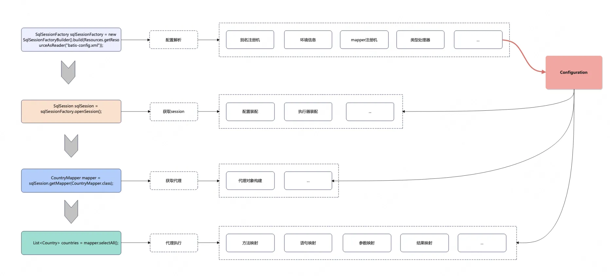

# 【主线】实现MyBatis：Chapter1: 搭建代理框架，体验造假的快乐
搭建整体代理执行框架

<!-- more -->

::: tip 本章目标
● 不创建接口实现类，直接通过接口调用的方式执行其定义的方法
::: 

## 一、过程分析
首先，了解过 Java 动态代理的同学，对于“在没有接口实现类的前提下进行接口调用”这件事情就不会感到那么神奇，而动态代理本身的使用也并不复杂，所以我们在代理功能实现的基础上，尽量搭建一套靠近 MyBatis 真实运行结构的框架，主要包括代理类的创建、配置数据结构存储，对于真正的执行部分，我们本章只会返回一个假的数据~
## 二、核心设计
### 2.1 代理创建
首先会是我们代理类，它的逻辑基本是 Java 动态代理机制的一种使用。需要感知的信息除了必要的接口类外，我们还额外存储了一个 SqlSession 对象，SqlSession是 MyBatis 中非常重要的一个概念，这里我们先不深究
```java
@Slf4j
public class MapperProxy<T> implements InvocationHandler {
    private SqlSession sqlSession;
    private Class<?> mapperInterface;

    public MapperProxy(SqlSession sqlSession, Class<?> mapperInterface) {
        this.sqlSession = sqlSession;
        this.mapperInterface = mapperInterface;
    }

    @Override
    public Object invoke(Object proxy, Method method, Object[] args) throws Throwable {
        log.info("MapperProxy代理执行方法:{}", method.getName());
        Country mock = new Country();
        mock.setId(110L);
        mock.setCountryCode("MOCK");
        mock.setCountryName("这是一个假的数据");
        return mock;
    }
}
```
有了简单的代理类后，我们再来定义一个代理工厂，因为我们之后会有不少的配置数据是需要在大于单个 MapperProxy实例 的作用域生效的
```java
public class MapperProxyFactory<T> {
    private Class<T> mapperInterface;

    public MapperProxyFactory(Class<T> mapperInterface) {
        this.mapperInterface = mapperInterface;
    }

    public <T> T newInstance(SqlSession sqlSession) {
        MapperProxy<T> mapperProxy = new MapperProxy<>(sqlSession, mapperInterface);
        return newInstance(mapperProxy);
    }

    private <T> T newInstance(MapperProxy<T> mapperProxy) {
        return (T) Proxy.newProxyInstance(mapperInterface.getClassLoader(), new Class[]{mapperInterface}, mapperProxy);
    }
}
```
### 2.2 配置存储
如上所述，我们有配置数据是需要在大于单个 `MapperProxy`实例 的作用域生效的，所有我们引入了 `MapperProxyFactory`，它以 `Class` 为粒度进行存储，也就是说存在一个 `Map<Class<?>, MapperProxyFactory<?>> knownMappers`的映射供运行时调用，那这个映射在何时初始化数据呢？答案是配置解析时，毕竟配置解析过程是必须的，在配置解析后初始化这份映射，相当于额外维护了配置是否解析成功的信息，在运行时就可以提供校验。
代理工厂映射的存储形式则是以 `MapperRegistry`对象的方式作为 `Configuration`的字段存在，以下为它目前的逻辑
```java
public class MapperRegistry {
    private Configuration configuration;

    private Map<Class<?>, MapperProxyFactory<?>> knownMappers = new HashMap<>();

    public MapperRegistry(Configuration configuration) {
        this.configuration = configuration;
    }

    public void addMapper(Class<?> type) {
        MapperProxyFactory<?> mapperProxyFactory = new MapperProxyFactory<>(type);
        knownMappers.put(type, mapperProxyFactory);
    }

    public <T> T getMapper(Class<T> type, SqlSession sqlSession) {
        MapperProxyFactory<T> mapperProxyFactory = (MapperProxyFactory<T>) knownMappers.get(type);
        return mapperProxyFactory.newInstance(sqlSession);
    }
}
```
### 2.3 Session 体系
`Session` 在 Mybatis 中是一个非常重要的概念，它承接了非常多的功能，我们最初的 `getMapper`方法就是通过它向客户端暴露。同样的，它也向上的一个工厂类。他们的接口定义如下：
```
public interface SqlSessionFactory {
    SqlSession openSession();
}

public interface SqlSession {
    <T> T getMapper(Class<T> type);
}
```
至于实现类，我们本章会使用硬编码的方式写一些固定逻辑，而且，因为我们暂时没有配置解析的过程，我们在`MockSqlSession` 中手动注册了一个代理工厂，对应的接口就是我们之后测试会用的 `CountryMapper`
```java
//只会返回固定的MockSqlSession实例
public class MockSqlSessionFactory implements SqlSessionFactory {
    @Override
    public SqlSession openSession() {
        return new MockSqlSession(new Configuration());
    }
}

public class MockSqlSession implements SqlSession {
    private final Configuration configuration;
    private MapperRegistry mapperRegistry;

    public MockSqlSession(Configuration configuration) {
        this.configuration = configuration;
        this.mapperRegistry = new MapperRegistry(configuration);
        mapperRegistry.addMapper(CountryMapper.class);
    }

    @Override
    public <T> T getMapper(Class<T> type) {
        return mapperRegistry.getMapper(type, this);
    }
}
```
### 2.4 测试用的数据类
定义一个 `Country` 类用于我们之后的测试，同时 db 里可以自己插入几条数据
```java
public class Country {
    private Long id;
    private String countryName;
    private String countryCode;
}

//此时接口是没有实现的，其实也没有mapper的xml
public interface CountryMapper {
    Country selectTestCountry();
}
```
三、整体架构
单纯的 Java 动态地理逻辑并不复杂，但是我们在使用 MyBatis 的过程中也不会自己创建代理对象，所以我们本章也将代理的创建与 MyBatis 的整体运行结合起来，在理解动态代理的逻辑基础上，更关系 MyBatis 是在何时何地以何种方式悄咪咪给我们返回了代理对象。

本章涉及到的类包括 SqlSessionFactory、SqlSession、Configuration、MapperProxy以及 MapperProxyFactory，整体流程是
● SqlSessionFactory在创建时会扫描配置信息，将所有信息汇聚成Configuration进行记录，其中对于每一个 Mapper 接口在解析完相应信息后会创建MapperProxyFactory对象，并维护好 Mapper 类到MapperProxyFactory对象的映射关系，该映射及其余的一些信息被封装为 MapperRegistry
● 我们通过SqlSession获取Mapper实例时，会通过Configuration获取到映射信息，进而拿到MapperProxyFactory对象后创建真正的MapperProxy实例，该实例也是我们业务代码中持有的真实对象
● 我们通过MapperProxy对象进行接口方法调用时方法被拦截，进而执行相关的 DB 操作

至此，我们简单的代理框架搭建完毕，现在我们的目录结构如下:
```shell
.
└── mybatis
    ├── binding
    │   └── MapperRegistry.java
    ├── proxy
    │   ├── MapperProxy.java
    │   └── MapperProxyFactory.java
    ├── session
    │   ├── Configuration.java
    │   ├── MockSqlSession.java
    │   ├── MockSqlSessionFactory.java
    │   ├── SqlSession.java
    │   └── SqlSessionFactory.java
    └── testdata
        ├── CountryMapper.java
        └── dao
            └── Country.java
```
## 四、测试验证
加下来，编写一个简单的测试代码，通过最总的输出，我们确定我们的代理逻辑确实生效了~ 下一步我们将通过对 DB 配置信息的解析，从数据库中获取一条真实的数据
```java
@Slf4j
public class MapperProxyTest {
    @Test
    public void test() {
        CountryMapper mapper = new MockSqlSessionFactory().openSession().getMapper(CountryMapper.class);
        Country country = mapper.selectTestCountry();
        log.info("country:{}", country);
        Assert.assertNotNull(country);
    }
}
```
不出意外，我们顺利得到符合预期的输出
```shell
// - MapperProxy代理执行方法:selectTestCountry
// - country:Country(id=110, countryName=这是一个假的数据, countryCode=MOCK)
```