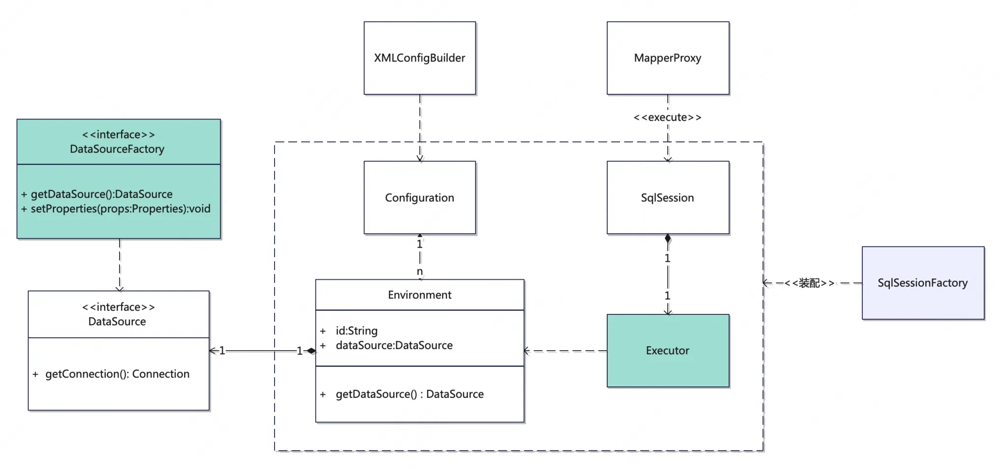

# 【主线】实现 MyBatis：Chapter2: 从 DB 读取真实的假数据

自定义数据源工厂，根据配置创建数据源对象，与数据库真实交互获取数据

<!-- more -->

:::tip 本章目的
● 读取数据库配置，“真实”地从数据中取出一条“假数据”
:::

## 一、过程分析

在上一章中，我们已将在代理类中成功拦截了方法执行，并返回了一条假的数据，而我们本章要做的，其实就是将这个执行过程替换为从 db 读一条固定数据返回，并且读取 db 所需要的信息我们需要从配置文件中读入。看起来，我们需要这么几个环节：

1. 配置信息的解析及记录。XML 文件结构的解析不是我们的重点，我们可以借助已有的工具类容易地拿到节点属性、值，我们解析后的结果可以放到某个结构中，然后以全局配置的形式存在
2. 在有了相关信息后，读取 db 数据理论上可以直接操作 jdbc，但我们这里还是选择使用一个线程的连接池
   此外，我们之前是在代理类中进行假数据的创建，但从单一职责的角度看，代理类只负责代理方法，真正后续与 DB 的交互操作我们引入 `Executor` 来负责，而 `SqlSession` 作为桥梁在二者间进行连接

## 二、核心设计

### 2.1 数据源

和数据源相关的主要有数据源工厂和具体的实现类，工厂方法本身在良好架构方面的意义不再赘述，而具体的实现类，我们定义了 `SimpleHikariDataSourceFactory`来固定返回 `HikariDataSource`，我们的目的不在数据源，所以不在此多做纠结。此外对于属性值，我们也只从配置中读取几个常用字段，其余的则是以硬编码方式完成。

```java
public interface DataSourceFactory {
    void setProperties(Properties props);
    DataSource getDataSource();
}

public class SimpleHikariDataSourceFactory implements DataSourceFactory {
    private String driver;
    private String url;
    private String username;
    private String password;

    @Override
    public void setProperties(Properties props) {
        this.driver = props.getProperty("driver");
        this.url = props.getProperty("url");
        this.username = props.getProperty("username");
        this.password = props.getProperty("password");
    }

    @Override
    public DataSource getDataSource() {
        HikariConfig config = new HikariConfig();
        config.setDriverClassName(driver);
        config.setJdbcUrl(url);
        config.setUsername(username);
        config.setPassword(password);
        config.addDataSourceProperty("cachePrepStmts", "true");
        config.addDataSourceProperty("prepStmtCacheSize", "250");
        config.addDataSourceProperty("prepStmtCacheSqlLimit", "2048");
        return new HikariDataSource(config);
    }
}
```

### 2.2 执行器

执行器部分，目前我们只定义一个 `Executor` 接口，在`MockExecutor` 实现中，我们使用获取到的真实连接从 DB 中读取一条数据返回

```java
public interface Executor {
    Object execute();
}

@Slf4j
public class MockExecutor implements Executor {
    private DataSource dataSource;

    public MockExecutor(DataSource dataSource) {
        this.dataSource = dataSource;
    }

    @Override
    public Object execute() {
        String sql = "select * from country order by id desc limit 1";
        log.info("从数据库中获取指定信息, 固定sql:{}", sql);
        try {
            ResultSet resultSet = dataSource.getConnection().prepareStatement(sql).executeQuery();
            if (resultSet.next()) {
                Long id = resultSet.getLong("id");
                String countryName = resultSet.getString("country_name");
                String countryCode = resultSet.getString("country_code");
                return new Country(id, countryName, countryCode);
            }

        } catch (Exception e) {
            log.error("execute error", e);
        }
        return null;
    }
```

### 2.3 配置解析

在这一部分中，我们引入正式的 `DefaultSqlSessionFactory`进行 `Session` 的构建，而它接受的 `Configuration`类型的入参则是由 `XMLConfigBuilder`对 XML 文件解析后传入，此过程中涉及到的对 XML 格式本身的解析我们则直接求助于现成的工具类~ 而在 `SqlSession`部分，我们也抛弃了之前的 `MockSqlSession` 对象，创建了正式的 `DefaultSqlSession`但是它目前也没有什么真正的逻辑，直接接力了一下代理调用过来的 `execute` 方法。这两部分逻辑简单，不再赘述
接下来是 `XMLConfigBuilder`，它需要接受一个 `XPathParser`对象，该对象可以帮助我们解析配置文件的节点信息，我们只需要知道它的获取方式就行，不必深究，我们的关注点在 `parse`方法。在 `parseEnvironments`方法中，我们通过获取到的节点信息，以反射方式拿到数据源工厂实例，传递对应的配置信息后，将工厂创建的数据源对象存储在全局配置中，这样执行器在执行时即可获取到可用的连接对象。

```java
@Slf4j
public class XMLConfigBuilder {
    private XPathParser parser;
    private Configuration configuration;

    private String environment;

    public XMLConfigBuilder(XPathParser parser) {
        this.parser = parser;
        this.configuration = new Configuration();
    }

    public Configuration parse() {
        log.info("开始解析配置文件");
        try {
            parseConfiguration(parser.evalNode("/configuration"));
            return configuration;
        } catch (Exception e) {
            log.error("解析配置文件失败",e);
            throw new RuntimeException(e);
        }
    }

    private void parseConfiguration(XNode xNode) throws Exception{
        //environments：用户名密码等
        parseEnvironments(xNode.evalNode("environments"));
    }

    public void parseEnvironments(XNode context) throws Exception {
        if (null == environment) {
            environment = context.getStringAttribute("default");
        }

        for (XNode node : context.getChildren()) {
            String id = node.getStringAttribute("id");
            if (!environment.equals(id)) {
                log.info("未采用的环境配置:{}", id);
                continue;
            }

            DataSourceFactory datasourceFactory = dataSourceElement(node.evalNode("dataSource"));
            Environment environment = new Environment();
            environment.setDataSource(datasourceFactory.getDataSource());
            configuration.setEnvironment(environment);
        }
    }

    private DataSourceFactory dataSourceElement(XNode context) throws Exception {
        if (context != null) {
            // 我们在type中指定数据源工厂的全类目，通过反射获取到实例
            String type = context.getStringAttribute("type");
            DataSourceFactory factory = (DataSourceFactory) Class.forName(type).newInstance();

            // 获取username等信息,将信息传递给数据源工厂
            Properties props = context.getChildrenAsProperties();
            factory.setProperties(props);
            return factory;
        }
        throw new RuntimeException("获取数据源工厂失败");
    }
```

## 三、整体架构



我们现在的目录结构如下：

```shell
.
└── mybatis
    ├── Executor
    │   ├── Executor.java
    │   └── MockExecutor.java
    ├── binding
    │   └── MapperRegistry.java
    ├── builder
    │   ├── BaseBuilder.java
    │   └── XMLConfigBuilder.java
    ├── datasource
    │   ├── DataSourceFactory.java
    │   └── SimpleHikariDataSourceFactory.java
    ├── mapping
    │   └── Environment.java
    ├── proxy
    │   ├── MapperProxy.java
    │   └── MapperProxyFactory.java
    ├── session
    │   ├── Configuration.java
    │   ├── DefaultSqlSession.java
    │   ├── DefaultSqlSessionFactory.java
    │   ├── SqlSession.java
    │   └── SqlSessionFactory.java
    └── testdata
        ├── CountryMapper.java
        └── dao
            └── Country.java

```

## 四、测试验证

首相我们要在配置文件中配置相关信息，尤其是 datasource 的 type，它应该指向我们的数据源工厂

```xml
 <environments default="development">
      <environment id="development">
          <transactionManager type="JDBC"/>
          <dataSource type="你的包路径.SimpleHikariDataSourceFactory">
              <property name="driver" value="com.mysql.cj.jdbc.Driver"/>
              <property name="url" value="..."/>
              <property name="username" value="..."/>
              <property name="password" value="..."/>
          </dataSource>
      </environment>
  </environments>
```

接下来，让我们执行以下测试

```java
@Slf4j
public class MainTest {
    @Test
    public void test() throws Exception {
        Configuration configuration = new XMLConfigBuilder(new XPathParser(Resources.getResourceAsReader("batis-config.xml"))).parse();
        CountryMapper mapper = new DefaultSqlSessionFactory(configuration).openSession().getMapper(CountryMapper.class);
        Country country = mapper.selectTestCountry();
        System.out.println(country);
        assertNotNull(country);
    }
}
```

而我们也成功得到以下输出：

```shell
22:56:08.331 [main] INFO  com.raymond.mybatis.builder.XMLConfigBuilder - 开始解析配置文件
22:56:08.362 [main] INFO  com.zaxxer.hikari.HikariDataSource - HikariPool-1 - Starting...
22:56:08.591 [main] INFO  com.zaxxer.hikari.HikariDataSource - HikariPool-1 - Start completed.
22:56:08.595 [main] INFO  com.raymond.mybatis.proxy.MapperProxy - MapperProxy代理执行方法:selectTestCountry, 交由Executor执行
22:56:08.595 [main] INFO  com.raymond.mybatis.Executor.MockExecutor - 从数据库中获取指定信息, 固定sql:select * from country order by id desc limit 1
Country(id=5, countryName=Germany, countryCode=DE)
```

至此，我们已经成功搭建起了一套从配置解析到代理执行框架，下一章我们将开始尝试进行 SQL 语句的真正解析执行。
