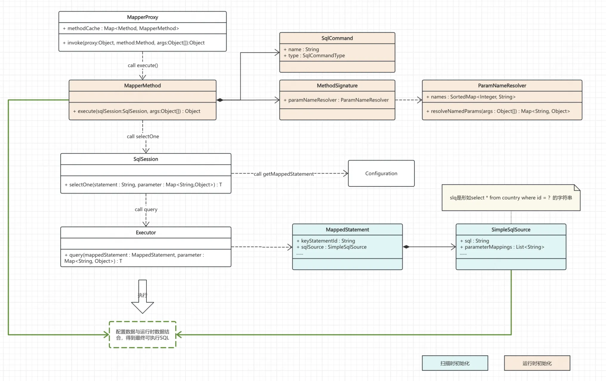

# 【主线】实现MyBatis：Chapter3: 解析SQL，浅尝参数匹配

将参数与SQL动态结合，执行真实数据查询

<!-- more -->
::: tip 本章目标
- 支持通过接口调用 `Country selectById(@Param("id") Long id)`，映射到 `select * from country where id = #{id}` 语句的执行
:::

## 一、过程分析
首先我们来分析一下，`select * from country where id = #{id}` 这个语句最终得到执行的流程是
1. 我们通过某种方式获取到 `select * from country where id = ?`的 Prepared SQL 语句
2. 我们通过某种方式得知 `Country selectById(@Param("id") Long id)`在调用时的入参 id 为 110
3. 我们通过 `preparedStatement.setLong(1, 110)`的方式执行 JDBC 的调用
4. 我们通过某种方式将得到的 `ResultSet`转化为我们想要的 `Country` 对象

**对于第一步**，我们通过 xml 的解析，可以直接拿到 `select * from country where id = #{id}`，对字符串进行处理后，我们除了可以得到想要的 Prepared SQL 之外，还可以得到一个占位符列表，将占位符索引与其名称映射起来，这个信息我们之后也会用到。

**对于第二步**，我们通过 `Method` 对象可以获得每个位置的参数的名称，而 `Method` 对象在代理执行的时候可以明确获得。此外，相同的 `Method` 的关于参数位置的信息都是相同的，我们可以将这个信息缓存起来。

**对于第三步**，我们通过前面获取到的参数、占位符相关的信息，其实在运行时是可以获得每个占位符索引对应的实参对象的。

**对于第四步**，我们暂时忽略实际的结果映射，我们本章只支持单个 `Country` 对象的查询。

## 二、核心设计
### 2.1 SQL 语句信息存储结构
我们定义一个 SqlSource 的结构来记录之前第一步中提到的信息，其中 sql字段即对应 Prepared SQL 信息，parameterMappings 字段采用有序的 List 结构记录占位符的名称，使用本身的索引信息来表示 Prepared SQL 中占位符的索引信息
```java
public class SimpleSqlSource {
    //select * from country where id = ?
    private final String sql;
    //有序List，元素索引即对应prepared sql中的索引，元素值为占位符名称，如“id”
    private final List<String> parameterMappings;
    //配置对象
    private final Configuration configuration;
}
```
### 2.2 Method 信息
而关于 method 信息，我们将其分为两部分：
一是和 SQL 相关的信息，我们将其定义为一个 SqlCommand 结构，其中包含一个 name 字段负责与静态解析的 MapperStatement 建立联系，另一 type 字段表示当前方法的增删改查类型，方便后续操作。
二是用于参数解析的相关信息，我们将其定义为 MethodSignature 结构，但其中真正的解析逻辑我们借助 ParamNameResolver 来实现。
```java
public class MapperMethod {
    // 记录了sql的名称和类型
    private final SqlCommand command;
    // 对应的方法签名
    private final MethodSignature method;

    public static class SqlCommand {
        // 对应到之前mappedStatement的id
        private final String name;
        //表示语句是增、删、改、查
        private final SqlCommandType type;
    }

    public static class MethodSignature {
         private final ParamNameResolver paramNameResolver;
    }
}
```
2.3 参数解析器
我们在之前 SQL 信息的存储中已经记录了占位符索引与名称的映射，如果我们再有一个占位符名称到实参的映射，那我们其实就可以得到真实的可执行的 SQL。ParamNameResolver就是负责这块内容。
首先，它的核心功能是返回一个映射数据，入参是运行时的参数信息 Object[] args，而获取这个信息需要通过 Method 对象的信息获取到形参索引和形参名称的映射，这个逻辑我们放在构造器去执行，将处理结果放在 names 字段中。

```java
//引用参数名称解析器
//提供方法形参的索引和参数名称的映射，如果有param修饰则使用其值。这个数据是为了配合sqlsource中的sql执行
//提供的映射结构是：SortedMap<Integer, String> names，比如 1:"id"表示方法的第一个实参对应的形参名称是id
public class ParamNameResolver {
    private final SortedMap<Integer, String> names;

    public ParamNameResolver(Configuration config, Method method) {   
    }

    public Map<String, Object> resolveNamedParams(Object[] args) {
    }
}
```
## 三、整体架构

结合上图，我们将整体流程概括如下：
1. 配置解析阶段，将 mapper 文件中的执行节点解析为两种数据：PreparedSQL 以及一份占位符 idx 与 name 的映射，信息存放在 MappedStatement中
2. 运行阶段，根据执行方法构建一个 MappedMethod 对象，几个依赖类在此完成参数绑定的核心逻辑，该逻辑放在 ParamNameResolver实例中
3. Proxy 对方法调用通过层层交接来到 Executor，Executor 根据已知信息拼出最终的可执行 SQL，固定从数据库获取单个 Country 对象并返回。

现在，我们的项目结构如下：
```shell
.
├── pom.xml
└── src
    ├── main
    │   ├── java
    │   │   └── com
    │   │       └── raymond
    │   │           └── mybatis
    │   │               ├── Executor
    │   │               │   ├── Executor.java
    │   │               │   └── SimpleExecutor.java
    │   │               ├── annotation
    │   │               │   └── Param.java
    │   │               ├── binding
    │   │               │   ├── MapperMethod.java
    │   │               │   └── MapperRegistry.java
    │   │               ├── builder
    │   │               │   ├── BaseBuilder.java
    │   │               │   ├── MapperBuilderAssistant.java
    │   │               │   ├── XMLConfigBuilder.java
    │   │               │   ├── XMLMapperBuilder.java
    │   │               │   └── XMLStatementBuilder.java
    │   │               ├── datasource
    │   │               │   ├── DataSourceFactory.java
    │   │               │   └── SimpleHikariDataSourceFactory.java
    │   │               ├── mapping
    │   │               │   ├── Environment.java
    │   │               │   ├── MappedStatement.java
    │   │               │   └── SqlCommandType.java
    │   │               ├── proxy
    │   │               │   ├── MapperProxy.java
    │   │               │   └── MapperProxyFactory.java
    │   │               ├── reflection
    │   │               │   └── ParamNameResolver.java
    │   │               ├── script
    │   │               │   └── SimpleSqlSource.java
    │   │               ├── session
    │   │               │   ├── Configuration.java
    │   │               │   ├── DefaultSqlSession.java
    │   │               │   ├── DefaultSqlSessionFactory.java
    │   │               │   ├── SqlSession.java
    │   │               │   └── SqlSessionFactory.java
    │   │               └── testdata
    │   │                   ├── CountryMapper.java
    │   │                   └── dao
    │   │                       └── Country.java
    │   └── resources
    │       ├── log4j2.xml
    │       └── mapper
    │           └── CountryMapper.xml
    └── test
        ├── java
        │   └── com
        │       └── raymond
        │           └── mybatis
        │               ├── MainTest.java
        │               ├── builder
        │               │   └── XMLMapperBuilderTest.java
        │               └── proxy
        └── resources
            └── batis-config.xml

```
## 四、测试验证
我们的数据库中 Country 表中目前有数据如下
```sql
id, country_name, country_code
1,United States,US
3,United Kingdom,GB
5,Germany,DE
2,Canada,CA
4,Australia,AU
```
我们通过如下测试验证
```java
@Slf4j
public class MainTest {
    Configuration configuration;
    CountryMapper mapper;

    @Before
    public void before() throws Exception {
        configuration =
                new XMLConfigBuilder(new XPathParser(Resources.getResourceAsReader("batis-config.xml"))).parse();
        mapper = new DefaultSqlSessionFactory(configuration).openSession().getMapper(CountryMapper.class);
    }

    @Test
    public void test() throws Exception {
        Country country = mapper.selectById(1L);
        System.out.println(country);
        assertNotNull(country);
        Assert.assertTrue(1L == country.getId());

        Country country2 = mapper.selectById(2L);
        System.out.println(country2);
        assertNotNull(country2);
        Assert.assertTrue(2L == country2.getId());
    }
}
```
结果符合预期！yes！
```shell
20:51:43.561 [main] INFO  com.raymond.mybatis.builder.XMLConfigBuilder - 开始解析配置文件
20:51:43.587 [main] INFO  com.zaxxer.hikari.HikariDataSource - HikariPool-1 - Starting...
20:51:45.210 [main] INFO  com.zaxxer.hikari.HikariDataSource - HikariPool-1 - Start completed.
20:51:45.408 [main] INFO  com.raymond.mybatis.proxy.MapperProxy - MapperProxy代理执行方法:selectById, 交由Executor执行
Country(id=1, countryName=United States, countryCode=US)
20:51:45.675 [main] INFO  com.raymond.mybatis.proxy.MapperProxy - MapperProxy代理执行方法:selectById, 交由Executor执行
Country(id=2, countryName=Canada, countryCode=CA)
```