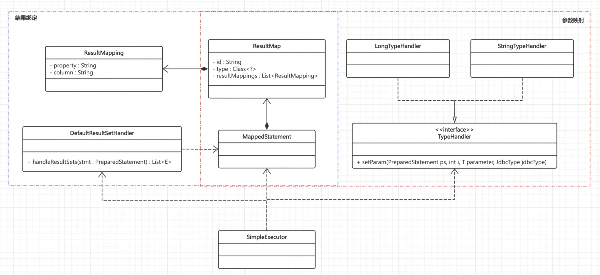

# 【主线】实现MyBatis：Chapter4: 完善参数绑定，引入结果映射

将参数与SQL动态结合，执行真实数据查询

<!-- more -->
::: tip 本章目标
- 支持 Country selectByIdAndName(@Param("id") String id, @Param("name") String name)的调用，且参数自行匹配，不需要 mock
- 支持结果的自动映射，新建 People selectById(@Param("id") Long id)只需修改配置即可执行
:::

## 一、过程分析
- 对于每个参数，我们已经在解析阶段就知道它对应的配置，而在运行时我们又拿到了实参，理论上只要把它和 sql 拼起来即可，但每种类型拼接到 sql 的方式可能不同，这里可能需要一个分支处理
- 对于返回结果，我们在解析时可以知道 resultMap 对应相关信息，知道具体的类型，知道每个字段与数据库列的关系，理论上我们可以通过反射构造相关对象

## 二、核心设计
参数绑定部分，我们直接以 Class 为 key 构建一个映射，value 是 TypeHandler，负责执行不同类型参数与 PreparedStatement 的整合，举例如下：
```java
public interface TypeHandler<T> {
    void setParameter(PreparedStatement ps, int i, T parameter, JdbcType jdbcType) throws SQLException;
}

public class StringTypeHandler implements TypeHandler<String> {
    @Override
    public void setParameter(PreparedStatement ps, int i, String parameter, JdbcType jdbcType) throws SQLException {
        ps.setString(i, parameter);
    }
}
```

结果映射部分，一是信息存储的 ResultMapping 和 ResultMap 结构，二是信息使用的 DefaultResultSetHandler，其构造实际是在 mapper 文件解析时，逻辑是节点取值，稍微繁琐但并不复杂，不再赘述
```java
public class ResultMap {
    // 全局配置信息
    private Configuration configuration;
    // resultMap的编号
    private String id;
    // 最终输出结果对应的Java类
    private Class<?> type;
    // XML中的<result>的列表，即ResultMapping列表
    private List<ResultMapping> resultMappings;
}

public class ResultMapping {
    private Configuration configuration;
    private String property;
    private String column;
}
```

而至于使用信息进行结果映射的部分，我们这里直接采用的最简单的方式，直接使用反射构造对象并给字段赋值（在 MyBatis 中则是创建了功能更为强大的工具类，封装的层次也更深）。
```java
public interface ResultSetHandler {
    <E> List<E> handleResultSets(PreparedStatement stmt) throws SQLException;
}

@Data
@AllArgsConstructor
public class DefaultResultSetHandler implements ResultSetHandler {
    private String statementId;
    private Configuration configuration;

    @Override
    public <E> List<E> handleResultSets(PreparedStatement stmt) throws SQLException {
        MappedStatement mappedStatement = configuration.getMappedStatement(statementId);
        ResultMap resultMap = mappedStatement.getResultMap();
        ResultSet resultSet = stmt.executeQuery();

        List<E> ret = new ArrayList<>();
        while (resultSet.next()) {
            handle(resultSet, resultMap, ret);
        }
        return ret;
    }

    private <E> void handle(ResultSet resultSet, ResultMap resultMap, List<E> ret) {
        try {
            Class<?> type = resultMap.getType();
            Object item = type.newInstance();
            for (ResultMapping resultMapping : resultMap.getResultMappings()) {
                String column = resultMapping.getColumn();
                String property = resultMapping.getProperty();
                Field field = type.getDeclaredField(property);
                field.setAccessible(true);
                field.set(item, resultSet.getObject(column));
            }
            ret.add((E) item);
        } catch (Exception e) {
            throw new RuntimeException(e);
        }
    }
}
```
## 三、整体架构


现在，我们的项目结构也来到这个样子：
::: details 项目结构
```shell
.
├── pom.xml
└── src
    ├── main
    │   ├── java
    │   │   └── com
    │   │       └── raymond
    │   │           └── mybatis
    │   │               ├── Executor
    │   │               │   ├── DefaultResultSetHandler.java
    │   │               │   ├── Executor.java
    │   │               │   ├── ResultSetHandler.java
    │   │               │   └── SimpleExecutor.java
    │   │               ├── annotation
    │   │               │   └── Param.java
    │   │               ├── binding
    │   │               │   ├── MapperMethod.java
    │   │               │   └── MapperRegistry.java
    │   │               ├── builder
    │   │               │   ├── BaseBuilder.java
    │   │               │   ├── MapperBuilderAssistant.java
    │   │               │   ├── XMLConfigBuilder.java
    │   │               │   ├── XMLMapperBuilder.java
    │   │               │   └── XMLStatementBuilder.java
    │   │               ├── datasource
    │   │               │   ├── DataSourceFactory.java
    │   │               │   └── SimpleHikariDataSourceFactory.java
    │   │               ├── mapping
    │   │               │   ├── Environment.java
    │   │               │   ├── MappedStatement.java
    │   │               │   ├── ResultMap.java
    │   │               │   ├── ResultMapping.java
    │   │               │   └── SqlCommandType.java
    │   │               ├── proxy
    │   │               │   ├── MapperProxy.java
    │   │               │   └── MapperProxyFactory.java
    │   │               ├── reflection
    │   │               │   └── ParamNameResolver.java
    │   │               ├── script
    │   │               │   └── SimpleSqlSource.java
    │   │               ├── session
    │   │               │   ├── Configuration.java
    │   │               │   ├── DefaultSqlSession.java
    │   │               │   ├── DefaultSqlSessionFactory.java
    │   │               │   ├── SqlSession.java
    │   │               │   └── SqlSessionFactory.java
    │   │               ├── testdata
    │   │               │   ├── CountryMapper.java
    │   │               │   ├── PeopleMapper.java
    │   │               │   └── dao
    │   │               │       ├── Country.java
    │   │               │       └── People.java
    │   │               └── type
    │   │                   ├── IntegerTypeHandler.java
    │   │                   ├── LongTypeHandler.java
    │   │                   ├── StringTypeHandler.java
    │   │                   ├── TypeHandler.java
    │   │                   └── TypeHandlerRegistry.java
    │   └── resources
    │       ├── log4j2.xml
    │       └── mapper
    │           ├── CountryMapper.xml
    │           └── PeopleMapper.xml
    └── test
        ├── java
        │   └── com
        │       └── raymond
        │           └── mybatis
        │               ├── MainTest.java
        │               ├── PeopleTest.java
        │               ├── builder
        │               │   └── XMLMapperBuilderTest.java
        │               └── proxy
        └── resources
            └── batis-config.xml

```
:::
## 四、测试验证
首先是我们多参数的自动绑定验证，结果不出意外
::: details 自动绑定验证
```java
@Test
public void test_select_id_name() throws Exception {
    Country country = mapper.selectByIdAndName(1L,"Canada");
    System.out.println(country);
    assertNull(country);

    Country country2 = mapper.selectByIdAndName(2L,"Canada");
    System.out.println(country2);
    assertNotNull(country2);
    Assert.assertTrue(2L == country2.getId());
}
/**
22:44:38.677 [main] INFO  com.raymond.mybatis.builder.XMLConfigBuilder - 开始解析配置文件
22:44:38.703 [main] INFO  com.zaxxer.hikari.HikariDataSource - HikariPool-1 - Starting...
22:44:38.881 [main] INFO  com.zaxxer.hikari.HikariDataSource - HikariPool-1 - Start completed.
22:44:39.813 [main] INFO  com.raymond.mybatis.proxy.MapperProxy - MapperProxy代理执行方法:selectByIdAndName, 交由Executor执行
null
22:44:39.858 [main] INFO  com.raymond.mybatis.proxy.MapperProxy - MapperProxy代理执行方法:selectByIdAndName, 交由Executor执行
Country(id=2, countryName=Canada, countryCode=CA)
*/
```
:::

接下来是新构建类的测试，我们新建了 People类，新建了对应的 PeopleMapper接口和对应的 xml 文件，同时在配置文件中增加了对应的 mapper 扫描路径

::: details 接口与类
```java
@Data
@NoArgsConstructor
@AllArgsConstructor
public class People {
    private Long id;
    private String name;
}

public interface PeopleMapper {
    People selectById(@Param("id") Long id);
}
```
:::

::: details mapper的xml配置
```xml
<?xml version="1.0" encoding="UTF-8" ?>
<!DOCTYPE mapper
        PUBLIC "-//mybatis.org//DTD Mapper 3.0//EN"
        "https://mybatis.org/dtd/mybatis-3-mapper.dtd">
<mapper namespace="com.raymond.mybatis.testdata.PeopleMapper">
    <resultMap id="resultMap" type="com.raymond.mybatis.testdata.dao.People">
        <id property="id" column="id"></id>
        <result property="name" column="name"/>
    </resultMap>
    <select id="selectById" resultMap="resultMap">
        select * from people where id = #{id}
    </select>
</mapper>
```
:::

::: details mybatis配置

```xml
<?xml version="1.0" encoding="UTF-8" ?>
<!DOCTYPE configuration
        PUBLIC "-//mybatis.org//DTD Config 3.0//EN"
        "https://mybatis.org/dtd/mybatis-3-config.dtd">
<configuration>
    <typeAliases>
        <typeAlias type="com.raymond.mybatis.datasource.SimpleHikariDataSourceFactory"
                   alias="SimpleHikariDataSourceFactory"/>
    </typeAliases>
    <environments default="development">
        <environment id="development">
            <transactionManager type="JDBC"/>
            <dataSource type="com.raymond.mybatis.datasource.SimpleHikariDataSourceFactory">
                <property name="driver" value="com.mysql.cj.jdbc.Driver"/>
                <property name="url" value="jdbc:mysql://localhost:3306/raybatis"/>
                <property name="username" value="root"/>
                <property name="password" value=""/>
            </dataSource>
        </environment>
    </environments>
    <mappers>
        <mapper resource="mapper/CountryMapper.xml"/>
        <mapper resource="mapper/PeopleMapper.xml"/>
    </mappers>
</configuration>
```
:::

当然，结果也符合预期!
::: details 测试结果
```shell
22:48:12.201 [main] INFO  com.raymond.mybatis.builder.XMLConfigBuilder - 开始解析配置文件
22:48:12.227 [main] INFO  com.zaxxer.hikari.HikariDataSource - HikariPool-1 - Starting...
22:48:12.399 [main] INFO  com.zaxxer.hikari.HikariDataSource - HikariPool-1 - Start completed.
22:48:12.747 [main] INFO  com.raymond.mybatis.proxy.MapperProxy - MapperProxy代理执行方法:selectById, 交由Executor执行
People(id=1, name=Alice)
```
:::