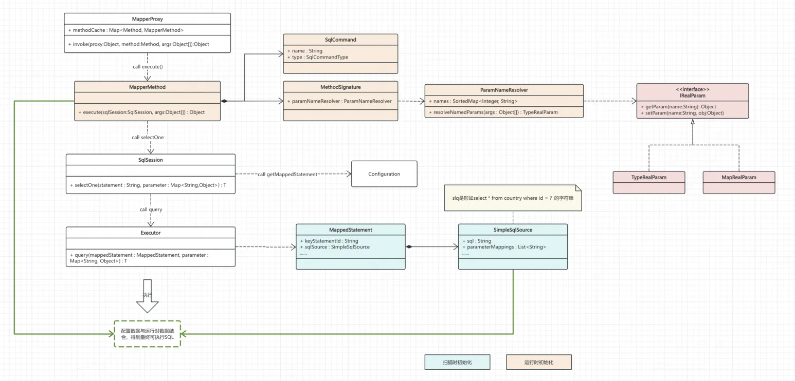

# 【主线】实现 MyBatis：Chapter5: 功能完善，支持批量查询与增删改

以 DO 作为入参实现数据插入，并完成主键回填

<!-- more -->

:::tip 本章目标

- 支持 `List<Country> selectByName(@Param("name") String name)`批量查询
- 支持更新、删除语句
  - `int updateNameById(@Param("id") Long id, @Param("name") String name)`
  - `int deleteById(@Param("id") Long id);`
- 支持 update 和 delete 操作
- 支持插入语句 int insertCountry(Country country);，提供主键回填
  :::

## 一、过程分析

对于批量查询，jdbc 给我们返回的是结果集，此处增加一个 for 循环的逻辑并配合一些 api 的改动接口；对于删除和更新语句，本质和查询语句没有区别，并且更新行数 jdbc 也会给到我们；
对于插入语句，起码有以下几点

- 需要得到对象字段到数据库字段的映射
- 需要获取到插入数据后得到的主键
- 需要持有入参对象，并将主键 id 回填
  在我们之前的逻辑中，直接使用了 Map 来存储实参映射，如果入参是 DO 对象的话，通过反射也是可以实现类似的功能，此处需要一层抽象来屏蔽 Map 和 DO 对象根据形参获取实参的逻辑差异；插入数据后生成的主键，我们可以从 resultset 中获取到，并且因为我们持有了实参对象，也可将主键回填到对象中，此处我们可以默认主键固定为 id 字段

## 二、核心设计

### 2.1 抽象实参类

我们的入参支持两种形式，一是直接以字段的形式入参，配合`param`注解实现参数绑定，二是以 DO 的方式传入对象，以对象字段名作为参数名进行实参绑定，我们将这两种方式抽象出`IRealParam`接口，提供参数的读取和写入，其中写入主要是为了`insert`后的参数回填。接口定义如下：

```java
public interface IRealParam {
    Object getParam(String name);

    void setParam(String name, Object value);
}
```

我们之前参数绑定的逻辑中支持的就是第一种字段形式的入参，MapRealParam 负责承载这部分逻辑

```java
public class MapRealParam implements IRealParam {
    private Map<String, Object> paramMap;

    public MapRealParam(Map<String, Object> paramMap) {
        this.paramMap = paramMap;
    }

    @Override
    public Object getParam(String name) {
        return paramMap.get(name);
    }

    @Override
    public void setParam(String name, Object value) {
        // nothing
    }
}
```

对于第二种方式的入参，我们使用 TypeRealParam 来处理这部分逻辑，其核心逻辑就是通过反射来获取字段值或者给字段赋值。如果做进一步优化的话，这里可以维护部分额外的信息，以空间换取实现，对于同一类型的参数可省略多余的反射过程，但此处我们不会再做进一步的处理。

```java
@Slf4j
public class TypeRealParam implements IRealParam {
    private Object obj;
    private Class<?> objClass;

    public TypeRealParam(Object obj) {
        this.obj = obj;
        this.objClass = obj.getClass();
    }

    @Override
    public Object getParam(String name) {
        return getFieldValueByReflect(obj, name);
    }

    @Override
    public void setParam(String name, Object value) {
        try {
            Field field = objClass.getDeclaredField(name);
            field.setAccessible(true);
            field.set(obj, value);
        } catch (Exception e) {
            log.error("TypeRealParam setParam error, name:{}, value:{}", name, value, e);
            throw new RuntimeException(e);
        }
    }

    private Object getFieldValueByReflect(Object obj, String name) {
        try {
            Class<?> countryClass = obj.getClass();
            Field field = countryClass.getDeclaredField(name);
            field.setAccessible(true);
            Object ret = field.get(obj);
            log.info("getFieldValueByReflect success, obj:{}, name:{}, ret:{}", obj.getClass().getSimpleName(), name,
                    ret);
            return ret;
        } catch (Exception e) {
            log.error("getFieldValueByReflect error, obj:{}, name:{}", obj.getClass().getSimpleName(), name, e);
        }
        return null;
    }
}
```

### 2.2 参数解析器

我们之前参数绑定的逻辑中支持的就是第一种字段形式的入参，`MapRealParam`负责承载这部分逻辑

```java
//引用参数名称解析器
//提供方法形参的索引和参数名称的映射，如果有param修饰则使用其值。这个数据是为了配合sqlsource中的sql执行
//提供的映射结构是：SortedMap<Integer, String> names，比如 1:"id"表示方法的第一个实参对应的形参名称是id
public class ParamNameResolver {
    private final SortedMap<Integer, String> names;

    public ParamNameResolver(Configuration config, Method method) {
    }

    public IRealParam resolveNamedParams(Object[] args) {
        if (!hasParamAnnotation && names.size() == 1) {
            return new TypeRealParam(args[0]);
        }

        final Map<String, Object> param = new MapperMethod.ParamMap<>();
        for (Map.Entry<Integer, String> entry : names.entrySet()) {
            //根据之前记录的形参名称和id的映射，构建形参名称--实参的映射
            param.put(entry.getValue(), args[entry.getKey()]);
        }
        return new MapRealParam(param);
    }
}
```

## 三、整体架构



现在，我们的项目结构也来到这个样子

```shell
├── Executor
│   ├── DefaultResultSetHandler.java
│   ├── Executor.java
│   ├── ResultSetHandler.java
│   └── SimpleExecutor.java
├── annotation
│   └── Param.java
├── binding
│   ├── IRealParam.java
│   ├── MapRealParam.java
│   ├── MapperMethod.java
│   ├── MapperRegistry.java
│   └── TypeRealParam.java
├── builder
│   ├── BaseBuilder.java
│   ├── MapperBuilderAssistant.java
│   ├── XMLConfigBuilder.java
│   ├── XMLMapperBuilder.java
│   └── XMLStatementBuilder.java
├── datasource
│   ├── DataSourceFactory.java
│   └── SimpleHikariDataSourceFactory.java
├── mapping
│   ├── Environment.java
│   ├── MappedStatement.java
│   ├── ResultMap.java
│   ├── ResultMapping.java
│   └── SqlCommandType.java
├── proxy
│   ├── MapperProxy.java
│   └── MapperProxyFactory.java
├── reflection
│   └── ParamNameResolver.java
├── script
│   └── SimpleSqlSource.java
├── session
│   ├── Configuration.java
│   ├── DefaultSqlSession.java
│   ├── DefaultSqlSessionFactory.java
│   ├── SqlSession.java
│   └── SqlSessionFactory.java
├── testdata
│   ├── CountryMapper.java
│   ├── PeopleMapper.java
│   └── dao
│       ├── Country.java
│       └── People.java
└── type
    ├── IntegerTypeHandler.java
    ├── LongTypeHandler.java
    ├── StringTypeHandler.java
    ├── TypeHandler.java
    └── TypeHandlerRegistry.java
```

:::

## 四、测试验证

本章的重头戏是插入，我们写一个简单的测试

```java
@Test
public void test_insert() throws Exception {
    Country country = new Country();
    country.setCountryCode("test_insert_code");
    country.setCountryName("test_insert_name");
    int cnt = mapper.insertCountry(country);

    Assert.assertTrue(1 == cnt);
    Assert.assertNotNull(country.getId());
    System.out.println(country);
}
```

结果不出所料：

```shell
18:38:15.746 [main] INFO  com.raymond.mybatis.builder.XMLConfigBuilder - 开始解析配置文件
18:38:15.763 [main] INFO  com.zaxxer.hikari.HikariDataSource - HikariPool-1 - Starting...
18:38:15.899 [main] INFO  com.zaxxer.hikari.HikariDataSource - HikariPool-1 - Start completed.
18:38:16.233 [main] INFO  com.raymond.mybatis.proxy.MapperProxy - MapperProxy代理执行方法:insertCountry, 交由Executor执行
18:38:16.249 [main] INFO  com.raymond.mybatis.binding.TypeRealParam - getFieldValueByReflect success, obj:Country, name:countryName, ret:test_insert_name
18:38:16.249 [main] INFO  com.raymond.mybatis.binding.TypeRealParam - getFieldValueByReflect success, obj:Country, name:countryCode, ret:test_insert_code
Country(id=21, countryName=test_insert_name, countryCode=test_insert_code)
```

至此，我们实现 MyBatis 主线系列完结撒花！新年快乐

--结束于 2025-01-18
