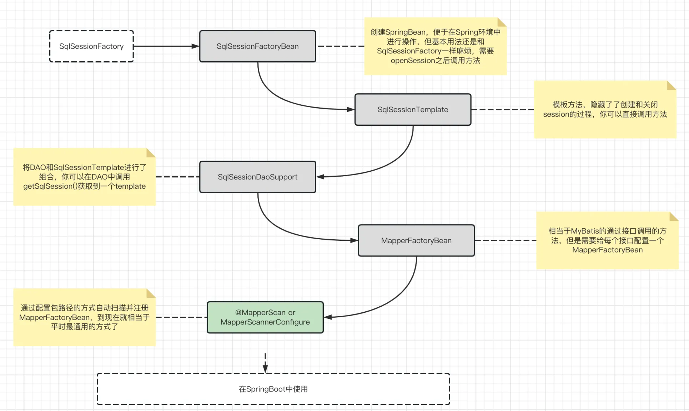
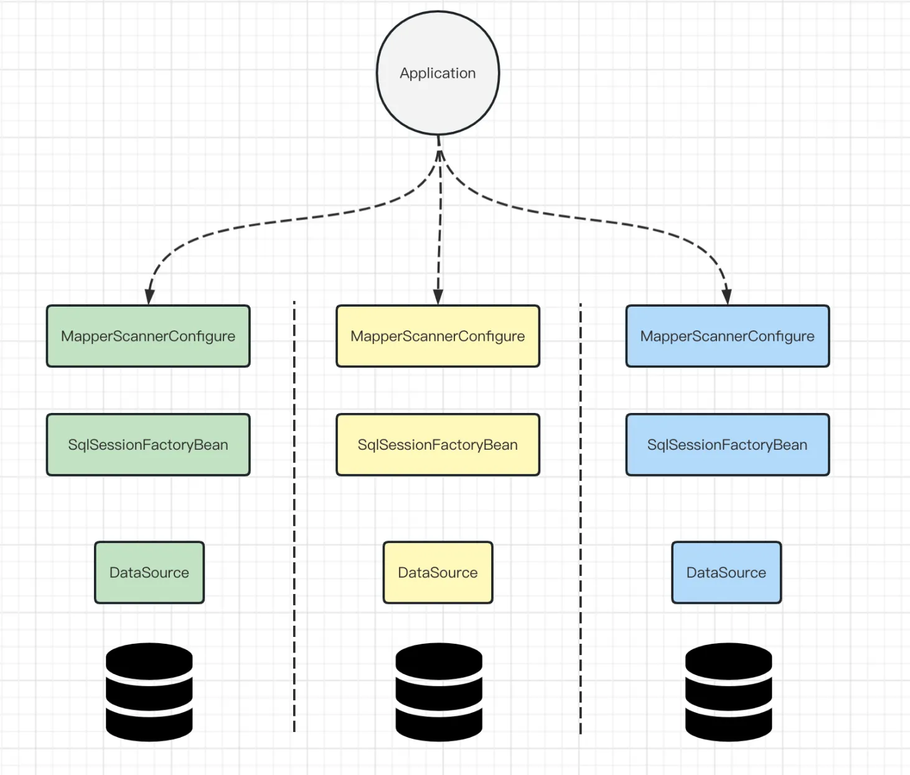

# MyBatis使用4：与Spring整合

MyBatis与Spring整合

<!-- more -->


在使用Mybatis-Spring的过程中，有复杂到简单可以有多种使用方式，如下图所示


## 一、SqlSessionFactoryBean
使用Mybatis-Spring之后，我们不在直接使用SqlSessionFactory，取而代之的是SqlSessionFactoryBean，关于SqlSessionFactoryBean的配置，可以有两种方式，一是基于MyBatis自己原来的配置文件做一些调整，而是完全舍弃MyBatis的配置文件，只配置Bean属性
基于mybatis的配置：
需要注意的是，有关数据源和事务管理器的部分，我们不会在MyBatis配置文件的environments标签里面配置了，即便是配置了也会被spring忽略，现在我们需要单独指定这两部分的信息
```xml
<!—-SqlSessionFactoryBean-—>
<bean id="sqlSessionFactory" class="org.mybatis.spring.SqlSessionFactoryBean”>
     <!--数据源配置-->
     <property name="dataSource" ref="dataSource”/>
     <!--通过configLocation属性指定mybatis核心配置文件mybatis-config.xml路径-->
     <property name="configLocation" value="classpath:mybatis/mybatis-config.xml"/>
</bean>
​
<!--数据源使用druid-->
<bean id="dataSource" class="com.alibaba.druid.pool.DruidDataSource">
        <property name="username" value="root"/>
        <property name="password" value=“your password"/>
        <property name="url" value="jdbc:mysql://localhost:3306/mybatis"/>
        <property name="driverClassName" value="com.mysql.jdbc.Driver”/>
        <!--其他配置-->
</bean>
 ```
不基于MyBatis的配置：
所谓不基于MyBatis的配置，指的是将相关的配置信息以Bean属性的形式直接在Bean定义里面写好。需要mybatis-spring1.3.0以后
```xml
<bean id="sqlSessionFactory" class="org.mybatis.spring.SqlSessionFactoryBean">
    <property name="dataSource" ref="dataSource"/>
    <property name="typeAliasesPackage" value="com.tianshouzhi.zebracost.entity”/>
    <!--从类路径下加载在mybatis/mappers包和它的子包中所有的 MyBatis 映射器 XML 文件-->
    <property name="mapperLocations" value="classpath*:mybatis/mappers/**/*.xml"></property>
    <property name="configuration">
        <bean class="org.apache.ibatis.session.Configuration">
            <property name="mapUnderscoreToCamelCase" value="true"/>
            <property name="cacheEnabled" value="true"/>
            <property name="defaultExecutorType" value="SIMPLE"/>
        </bean>
    </property>
 </bean>
 ```
## 二、SqlSessionTemplate
SqlSessionFactoryBean其实没做什么事情，它只是把SqlSessionFactory接入到了Spring框架中，在使用的时候依然需要获取session然后关闭session，而这一部分就非常适合用模板方法进行优化，刚好这里有个SqlSessionTemplate就是做这个的。
SqlSessionTemplate是依赖SqlSessionFactory的，配置如下：
```xml
<bean id="sqlSessionTemplate" class="org.mybatis.spring.SqlSessionTemplate">
        <constructor-arg index="0" ref="sqlSessionFactory"/>
</bean>
```
在使用的时候，可以通过注入SqlSessionTemplate对象并通过该对象执行Session接口定义的操作
```java
public class UserDao {
    private static String NAMESPACE = "xxx";

    @Autowired
    SqlSessionTemplate sqlSession;

    public User selectById(int id) {
        User user = sqlSession.selectOne(NAMESPACE + ".selectById",id);
        return user;
    }
}
```
SqlSessionTemplate是线程安全的，因为它的方法调用逻辑其实是通过代理对象每次新建session后再关闭，可以说它真就是一个比较纯粹的模板方法。下面简单看下它方法调用时代理的invoke逻辑，可以看到它通过SqlSessionUtils.getSqlSession拿到SqlSession对象，通过该对象执行业务逻辑，然后finally关闭SqlSession，这和我们自己写的逻辑基本一致，而SqlSessionUtils.getSqlSession中也是new了一个新对象
```java
private class SqlSessionInterceptor implements InvocationHandler {
    public Object invoke(Object proxy, Method method, Object[] args) throws Throwable {
        SqlSession sqlSession = SqlSessionUtils.getSqlSession(SqlSessionTemplate.this.sqlSessionFactory, SqlSessionTemplate.this.executorType, SqlSessionTemplate.this.exceptionTranslator);
        Object unwrapped;
        try {
            Object result = method.invoke(sqlSession, args);
            if (!SqlSessionUtils.isSqlSessionTransactional(sqlSession, SqlSessionTemplate.this.sqlSessionFactory)) {
                sqlSession.commit(true);
            }
            unwrapped = result;
        } catch (Throwable var11) {
           ...
        } finally {
            if (sqlSession != null) {
                SqlSessionUtils.closeSqlSession(sqlSession, SqlSessionTemplate.this.sqlSessionFactory);
            }
        }
        return unwrapped;
    }
}
```
## 三、SqlSessionDaoSupport
如果你觉得用SqlSessionTemplate来进行数据操作不符合你的认知，你认为数据操作就该和对应的DAO对象关联在一起, 那么现在有个SqlSessionDaoSupport可以满足你, 让你的DAO继承它，然后在Bean定义里给他一个SqlSessionFactory（内部也是转成SqlSessionTemplate）或者SqlSessionTemplate，之后你就可以将getSqlSession的操作封装到DAO里面。本质上就是一个组合的思路。
```xml
<bean id="dao" class="xxx">
<!--   <property name="sqlSessionFactory" ref="sqlSessionFactory" /> -->
  <property name="sqlSessionTemplate" ref="sqlSessionTemplate" />
</bean>
```
```java
public class Dao extends SqlSessionDaoSupport{
    private static String NAMESPACE = "xxx";

    public User selectById(int id) {
        Dao dao = getSqlSession().selectOne(NAMESPACE + ".selectById",id);
        return dao;
    }
}
```
## 四、MapperFactoryBean
上面描述的方式中，我们的数据查询的逻辑依然还是要自己写的，在MyBatis中提供了非常方便的接口映射SQL的方式，这在MyBatis-Spring中也是必不可少的，这就用到了MapperFactoryBean。
在MyBatis中如果要使用接口方式的话，需要以下几个步骤
● 有一个接口Mapper和一个SQL配置文件mapper.xml，其中配置文件的namespace和接口全限定名一致，配置文件中的方法id和接口中方法名称一直
● MyBatis的配置文件中的`<mappers>` 标签中包含了该Mapper
这样我们在调用的时候就可以通过类似Mapper m = session.getMapper(Mapper.class)的方式获取到接口对应的对象，通过该对象就能进行数据操作。
如果与Spring整合的话，Spring的风格就是@Autowire，但是如果直接注入Mapper的话不会成功，因为信息还没同步给Spring，而定义一个MapperFactoryBean就相当于把信息同步给了Spring容器。这个Bean定义同样需要传入一个SqlSessionFactory（内部也是转成SqlSessionTemplate）或者SqlSessionTemplate（优先级高），经过下面的配置，Mapper就可以被自动注入并使用了
```xml
<bean id="mapper" class="org.mybatis.spring.mapper.MapperFactoryBean">
  <property name="mapperInterface" value="Mapper" />
  <property name="sqlSessionFactory" ref="sqlSessionFactory" />
</bean>
```
## 五、MapperScannerConfigure
有了MapperFactoryBean之后，我们现在可以自动注入Mapper并使用了，但是还存在一个问题，那就是每个Mapper接口都要给它配置一个对应的MapperFactoryBean，相当繁琐，而对于这种情况，Spring风格的解决方案一般都是包扫描。
```xml
<bean class="org.mybatis.spring.mapper.MapperScannerConfigurer">
  <property name="basePackage" value="xxx.mappers" />
	<property name="markerInterface" value="design.by.yourself.MybatisMapperInterface"/>
	<!-- 这个注解类也是可选的，但是一般我们会使用mybatis提供的mapper注解 -->
  <property name="annotationClass" value="org.apache.ibatis.annotations.Mapper"/>
  
  <property name="sqlSessionFactoryBeanName" value="ssf_account"/>
</bean> 
```
当配置了扫描的包之后，会对路径进行递归扫描，而如果包里面有些接口是不需创建mapper对象的怎么办？如上面代码的3-5行所示，你可以指定接口或者注解类，当目标符合条件的时候才会被自动注入，这两个条件你可以选一个或者选两个，当两个都存在的时候就需要两个条件都满足。

MapperScannerConfigure会在上下文中自动寻找类型为SqlSessionFactory，或者SqlSessionTemplate的bean，然后用它来创建MapperFactoryBean，所以不指定改属性的话也能用，但是建议配置sqlSessionFactoryBeanName属性，当你不指定sqlSessionFactoryBeanName而让它自己去扫描时，如果对应的数据源配置（不只是数据源配置）中使用了占位符，那么会报错，这是为何？
我们知道Spring处理占位符是靠PropertyPlaceholderConfigurer，而MapperScannerConfigure执行是在PropertyPlaceholderConfigurer之前的，所以它识别不了占位符就会报错，而指定了sqlSessionFactoryBeanName之后就不会有这个问题（todo源码）

在2.0.3版本中貌似已经修复了这个问题，org.mybatis.spring.mapper.MapperScannerConfigurer#processPropertyPlaceHolders，它解决的方案是自己查了所有的属性占位符处理器后调用了一波
/*
 * BeanDefinitionRegistries are called early in application startup, before BeanFactoryPostProcessors. This means that
 * PropertyResourceConfigurers will not have been loaded and any property substitution of this class' properties will
 * fail. To avoid this, find any PropertyResourceConfigurers defined in the context and run them on this class' bean
 * definition. Then update the values.
 */
## 六、SpringBoot
MyBatis提供了一个启动器供SpringBoot使用
```xml
<dependency>
    <groupId>org.mybatis.spring.boot</groupId>
    <artifactId>mybatis-spring-boot-starter</artifactId>
    <version>1.1.1</version>
</dependency>
```
在默认情况下，你需要做的只是在application.yml中配置一下DataSource
```
spring:
  datasource:
    driver-class-name: com.mysql.jdbc.Driver
    url: jdbc:mysql://localhost:3306/mybatis
    username: root
    password: your password
```

默认情况下它会扫描根目录（启动类目录）下的有@Mapper注解的接口来进行Bean注册，需要注意的是，一旦你自己提供了MapperScannerConfigurer，或者配置了MapperFactoryBean，那么mybatis-spring-boot-starter的自动配置功能将会失效。此时所有关于mybatis与spring进行整合的配置，都需要由你自行控制。
## 七、多数据源
配置多个数据源的话，各个Bean配置的关系如下图所示，在MapperScannerConfigure的包扫描里面可以区分不同的Mapper
