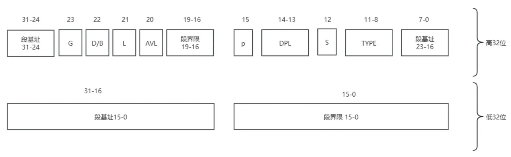

# 【手写操作系统】Chapter1：第一行C代码的运行
第一行C代码的运行

<!-- more -->

::: details 本章内容：
介绍从机器启动到第一行 C 代码被执行的过程，其中包括：
- MBR 的加载
- Loader 的加载
- 进入保护模式
- 开启分页
- 执行 C 代码
本章内容偏底层，较难理解，但大多是固定写法，理解即可
:::


## 一、MBR 的加载
简言之，主板通电后有 32mb 的固定内存布局，BIOS 自动执行自检等逻辑，一切顺利后会对 0 号扇区的内容进行格式校验后加载到地址 0x7c00 处，并将其送上 IP 开始执行，于是，0 号扇区得名主引导扇区 MBR，我们在其中写的代码可以直接被执行。下面看一段代码，用于在屏幕上打印 X

```asm
;simple_mbr

;告知编译器以16位进行编译
;计算机从16逐渐发展而来，不同位数的系统内寄存器使用方式不一样
;MBR加载时所处的实模式相当于16位模式，明确使用16位可避免不知名情况
;如果不显示指定，默认会是bits 16
bits 16;
;告知编译器编码从0x7c00开始
;汇编中涉及到很多地址操作，而我们明确得知代码会被加载到0x7c00处，
;此处保持一致也是避免一些地址使用方面的异常情况出现，不过我们的代码中没有这种逻辑
org 0x7c00

;tag
start:
    ;利用10中断打印
    mov ah, 0x0e
    mov al, 'X'
    int 0x10
  
;死循环阻止程序退出
hang:
    jmp hang;

;字节填充，凑够一个扇区的内容，其中$取当前地址，$$取代码段开始地址
times 510 - ($-$$) db 0;

;魔数（扇区签名）,和Java的cafebaby一样，用于格式校验
;MBR 的魔数其实是 0X55AA，但是 x86 是小端序，所以这里赋值的时候使用的是 0XAA55
dw 0xAA55;
```

### 1.1  相关工具介绍
- nasm：汇编代码有不同的风格，nasm是其中一种，我们采用的是这种，所以需要nasm编译器将我们的源代码编译成机器码
- dd：帮助我们进行数据复制。我们的学习过程是使用虚拟机+磁盘映像，MBR扇区有位置要求，所以我们需要借助dd工具将我们的代码放到指定位置。win环境下可以找dd的win版本
- bochs：一款虚拟机，是我们主要的运行环境。注意不同版本的有区别。笔者win下用的是2.6.2，mac下用的是2.8，二者使用上有差别。如非特殊指明，文中默认是win环境
### 1.2  实模式下的内存布局及机器启动后的固定流程
| Start  | End    | Size        | Description                                          |
|--------|--------|-------------|------------------------------------------------------|
| FFFF0  | FFFFF  | 16B         | BIOS入口地址，顶部64KB都是BIOS，此处16B只是强调其入口的作用。此处16字节的内容是跳转指令：jmp f000:e05b |
| F0000  | FFFEF  | 64KB - 16B  | 系统BIOS                                             |
| C8000  | EFFFF  | 160KB       | 映射硬件适配器的ROM或者内存映射式IO                           |
| C0000  | C7FFF  | 32KB        | 显示是配置BIOS                                        |
| B8000  | BFFFF  | 32KB        | 用于文本模式显示适配器                                      |
| B0000  | B7FFF  | 32KB        | 用于黑白显示适配                                        |
| A0000  | AFFFF  | 64KB        | 用于彩色显示适配                                        |
| 9FC00  | 9FFFF  | 1KB         | EBDA（Extended BIOS Data Area）扩展BIOS数据区             |
| 07E00  | 9FBFF  | 622080B 约 608KB | 可用区域                                               |
| 07C00  | 07DFF  | 512B        | MBR被BIOS加载到此处，共512字节                              |
| 0500   | 07BFF  | 30464B 约 30KB | 可用区域                                               |
| 0400   | 04FF   | 256B        | BIOS data area（BIOS数据区）                            |
| 0000   | 03FF   | 1KB         | interrupt vector table（中断向量表）                      |


### 1.3  开机后的固定流程：
1. 系统加电，CS：IP被固定设置为F000：FFF0，运算后得到的实际执行地址是FFFF0，也就是上述的BIOS入口地址，至此BIOS开始执行。
2. FFFF0到FFFFF之间的16B只有一条跳转指令：jmp f000:e05b，即跳转到FE05B继续执行，这个阶段可以理解为BIOS内部的执行逻辑。BIOS在执行过程中会执行硬件检查、创建中断向量表之类的事情。
3. BIOS执行的最后阶段，它会检查0盘0道1扇区的内容，格式无误后会将其加载到7C00处。格式校验的内容：此扇区末尾的两个字节分别是魔数0x55和0xaa
4. BIOS执行jmp 0:7C00，相当于正式移交了执行权。注意这里会将CS中的内容由之前的F000变为0000
此后可以认为是我们的操作系统开始执行
### 1.4  关于大端序与小端序：
我们知道一个字节8位，假设我有一个数据0x1234，显然它需要占用两个字节，现在我有两个字节的地址B1和B2，其中B1地址小于B2地址，那么我应该如何存储？数据12放在B1还是B2？
- 第一种方式：B1 B2 ：1234，将12放到了B1中，此时12是数据高位，B1是地址低位，这种将高位数据优先放入地址的方式称为大端序（近似理解为大数据优先）
- 第二种方式：B1 B2 ： 3412，将34放到了B1中，此时34是数据低位，B1是地址低位，这种将数据低位优先放入地址的方式称为小端序（近似理解为小数据优先）

小端序的优点：强制数据类型转换的时候不需要调整字节了。比如说现在0x1234是我定义的一个对象，它放在B1和B2中，注意对象地址指向的是B1这个地址，此时我对它进行强制类型转化，从2字节变为1字节，那最终对象的地址其实还是B1，而B1中存放的是34，数据上也符合强制类型转化的规则，如果是大端序的话就需要重新调整。 

大端序的优点：判断数据符号的时候方便。对于有符号数，符号放在高位中，根据大端序的特点，从对象的地址就可以直接计算出符号位。

常见大端序：IBM、Sun、PowerPC
常见小端序：X86、DEC
### 1.5  实模式下寄存器介绍
寄存器就是硬件层面的全局变量，起初是16位，后来是32位，再后来是64位，当向前兼容时，宽度大的寄存器会通过只使用低位的方式来模拟宽度小的寄存器。目前我们只需要看一下混个眼熟即可
| 寄存器            | 功能                                                                 |
|-------------------|----------------------------------------------------------------------|
| AX\BX\CX\DX\DI\SI\BP | 通用寄存器，按你的需要可以放数据、地址等                                   |
| IP                | 程序计数器，始终指向下一条指令地址                                          |
| SP                | 栈顶指针                                                               |
| CS\DS\ES\SS       | 段寄存器。16位时代的寻址时段基址偏移+指令地址，段寄存器内存放的就是段基址            |
| FLAGS             | 控制寄存器，里面有复杂的控制位                                             |


## 二、Loader 加载
简言之，MBR 只有 512 字节，放不下操作系统，所以 MBR 一般只当做跳板，我们真正的系统加载逻辑就称为 Loader，MBR 需要将执行权交给 Loader，这其中涉及到磁盘的读取。而读磁盘的操作，包括以一种固定的稍显繁琐的方式将需要读取的数据信息传递给磁盘的寄存器，之后触发读取命令，再之后即时轮询磁盘状态位，当数据准备就绪后即可读入指定地址
```asm
; 主引导程序
;-----------------------------------------------

;定义两个常量
LOADER_BASE_ADDR equ 0x900
LOADER_START_SECTOR equ 0x2

SECTION MBR vstart=0x7c00


mov eax, LOADER_START_SECTOR
mov bx, LOADER_BASE_ADDR
mov cx, 2
call rd_disk_m_16

jmp LOADER_BASE_ADDR

;-----------------------------------------------------------
; 读取磁盘的n个扇区，用于加载loader
; eax保存从硬盘读取到的数据的保存地址，ebx为起始扇区，cx为读取的扇区数
rd_disk_m_16:
;-----------------------------------------------------------

    mov esi, eax
    mov di, cx

    ;读一个扇区 
    mov dx, 0x1f2
    mov al, cl
    out dx, al

    mov eax, LOADER_START_SECTOR

    ;以LBA方式读取硬盘，分别设置LBA的低中高三部分，对应的端口号分别是0x1f3-0x1f5

    mov dx, 0x1f3
    out dx, al

    shr eax, 8
    mov dx, 0x1f4
    out dx, al

    shr eax, 8
    mov dx, 0x1f5
    out dx, al

    shr eax, 8
    and al, 0x0f; 只保留4位
    or al, 0xe0; 设置驱动器号
    mov dx, 0x1f6
    out dx, al


    mov dx, 0x1f7
    mov al, 0x20
    out dx, al

.not_ready:
    nop;                这是一个空操作指令，通常用于在循环中引入延迟或占位。
    in al, dx;          从端口dx读取一个字节到al。这里dx应该已经被设置为硬盘状态寄存器的端口号（通常是0x1F7）
    and al, 0x88;       对al进行按位与操作，保留al的第4位和第7位。这些位在IDE状态寄存器中通常代表设备忙（BSY）和数据请求（DRQ）状态。
    cmp al, 0x08;       将al与0x08比较，即检查DRQ位是否设置且BSY位未设置
    jnz .not_ready;     如果比较结果不为零（即DRQ未准备好或设备忙），则跳回到.not_ready，继续等待。

    mov ax, di;         将di寄存器的值（通常是扇区数）复制到ax寄存器。
    mov dx, 256;        将常数256加载到dx寄存器中
    mul dx;             每个扇区512字节，每次读一个字的数据=2字节，需要读取的次数就是512*扇区数/2, 也就是现在的256*扇区数。这个计算结果存储在dx:ax，ax存低位，dx存高位
    mov cx, ax;         将ax中的低16位结果复制到cx寄存器中，用于后续的循环传输数据
    mov dx, 0x1f0;      0x1F0加载到dx寄存器中，准备从此端口读取数据

.go_on_read:
    in ax, dx;          从dx指向的端口读16位到ax
    mov [bx], ax;       将ax数据复制到bx指向的地址，在我们的程序中这个值为LOADER_BASE_ADDR=0x900
    add bx, 2;          bx指针移动
    loop .go_on_read;   LOOP指令将CX寄存器的值减1，并检查结果。如果CX不为零，则跳转到标签.go_on_read，继续循环
    ret

times 510-($-$$) db 0
dw 0xAA55;
```
## 三、进入保护模式
```asm
loader_start: 
    ; 打开A20地址线
    in al, 0x92
    or al, 00000010B
    out 0x92, al

    ; 加载gdt
    lgdt [gdt_ptr]

    ; cr0第0位置1
    mov eax, cr0
    or eax, 0x00000001
    mov cr0, eax

    ; 刷新流水线
    jmp dword SELECTOR_CODE:p_mode_start
```
进入保护模式的流程相对固定，其核心代码如上，可见其主要包含四个环节，各环节简述如下：
- 开 A20 总线：实模式中地址线有 20 位，上古时代有些大哥会写地址回环的逻辑（地址对 20 位取模），冒然把地址线增加到 32 位会让有些历史逻辑报错，为了兼容就加了个开关，需要打开后才开启 32 位地址线
- 加载 GDT：在分页之前，分段地址管理就是最先进的手段，保护模式当年就是以一手分段管理问世，GDT 表就是分段内存管理的配套信息，必须有它，之后会细说
- 修改 CR0 标志位：就是修改标记位
- 刷新流水线：流水线是 CPU 的一种机制，相当于多指令同时执行，指令是分 16 位译码和 32 位译码的，我们现在需要切换模式了，要确保之前的 16 位指令不会再产生影响，所以需要刷新流水线，而“长跳”是可触发流水线刷新的一种方式。

### 3.1 构建并加载 GDT 表
实模式下的寻址是段寄存器左移 4 位之后与指令地址相加后获取实际物理地址，看似分段但其实没有段信息的维护，无法进行有效管理，于是在保护模式下有了 GDT 表。所谓的 GDT 表，可以理解为一个段描述信息数组，每个段信息固定 64 位，之前段寄存器中的数据会被解析成数组索引，于是在保护模式下，寻址会先通过段寄存器信息获取到段描述符，从描述符中获取段基址，段基址结合指令地址获取到真实地址。

短描述符结构如上，由于历史原因，其结构很混乱，段基址、段界限都需要自己拼（CPU 会有对应的缓存机制）。我们之后会开启分页，这里的分段模式只是一个必经的过渡阶段，我们的构建 GDT 表，就是确定几个描述符，也就是指定几个 64 位数据块。
根据约定，GDT 第一个描述符为空以避免歧义，此外我们需要一个数据段、一个代码段，以及我们需要一个显卡段来映射显卡内存。其实我们使用的是平坦模型，也就是实际只使用一个段来映射全部 4G 内存，所以这里定义的段大多是形式上的需要。描述符中各个位置的功能含义如下：

| 位数范围     | 名称                               | 描述                                                                 |
|--------------|----------------------------------|----------------------------------------------------------------------|
| 63-56        | Base Address 31:24               | 段基址的高 8 位                                                      |
| 55           | G (Granularity)                  | 粒度位，0：字节为单位，1：4KB 为单位                                 |
| 54           | D/B (Default/Big)                | 默认操作数大小，0：16 位，1：32 位                                   |
| 53           | L (64-bit code segment)          | 64 位代码段标志，仅在 64 位模式下有效                                |
| 52           | AVL                              | 系统软件可用位，通常未使用                                           |
| 51-48        | Limit 19:16                      | 段界限的高 4 位                                                      |
| 47           | P (Present)                      | 段存在位，0：未存在，1：存在                                         |
| 46-45        | DPL (Descriptor Privilege Level) | 描述符特权级，0：最高，3：最低                                       |
| 44           | S (Descriptor type)              | 描述符类型，0：系统段，1：代码或数据段                               |
| 43-40        | Type                             | 段类型，对于代码段和数据段有不同的含义                               |
| 39-32        | Base Address 23:16               | 段基址的中 8 位                                                      |
| 31-16        | Base Address 15:0                | 段基址的低 16 位                                                     |
| 15-0         | Segment Limit 15:0               | 段界限的低 16 位                                                     |

短描述符中，段界限有 20 位，配合 G 标识位将粒度定义为 4KB，刚好可以表示 32 位内存空间，也就是一个段就可以映射到整个 4G 内存，这就是平坦模型的来源

#### 3.1.1 定义描述符
```asm
; 这里其实就是GDT的起始地址，第一个描述符为空
GDT_BASE: dd 0x00000000
          dd 0x00000000
```
如上代码所示，定义描述符真就是字面意思的定义一个 64 位数据块，其余的描述符过程虽然繁琐，但套路是一样的。首先我们需要定义一些常量来帮助我们做二进制的计算
```asm
; gdt描述符属性
; 段描述符高23位，表示段界限的粒度为4KB
DESC_G_4K equ 100000000000000000000000b   
; D/B为，1表示运行在32位模式下
DESC_D_32 equ 10000000000000000000000b
; 高21位，如果为1表示为64位代码段，目前我们都是在32位模式下操作，故为零
DESC_L equ     0000000000000000000000b
; 没有明确的用途，取值随意
DESC_AVL equ   000000000000000000000b
; 第二部分段界限值，由于采用了32位平坦模型，所以段界限为(4GB / 4KB) - 1 = 0xFFFFF，故为全1
DESC_LIMIT_CODE2 equ 11110000000000000000b
DESC_LIMIT_DATA2 equ DESC_LIMIT_CODE2

DESC_LIMIT_VIDEO2 equ 0000000000000001011b
DESC_P equ 1000000000000000b
DESC_DPL_0 equ 000000000000000b
DESC_DPL_1 equ 010000000000000b
DESC_DPL_2 equ 100000000000000b
DESC_DPL_3 equ 110000000000000b
DESC_S_CODE equ  1000000000000b
DESC_S_DATA equ  DESC_S_CODE
DESC_S_sys equ  0000000000000b
DESC_TYPE_CODE equ 100000000000b
DESC_TYPE_DATA equ 001000000000b

; 代码段描述符的高32位表示，其中(0x00 << 24表示最高8位的段基址值，由于我们采用的是平坦模型，故基址为零)，后面唯一可变的就是段界限值
DESC_CODE_HIGH4 equ (0x00 << 24) + DESC_G_4K + DESC_D_32 + \
    DESC_L + DESC_AVL + DESC_LIMIT_CODE2 + \
    DESC_P + DESC_DPL_0 + DESC_S_CODE + DESC_TYPE_CODE + 0x00

DESC_DATA_HIGH4 equ (0x00 << 24) + DESC_G_4K + DESC_D_32 + \
    DESC_L + DESC_AVL + DESC_LIMIT_DATA2 + \
    DESC_P + DESC_DPL_0 + DESC_S_DATA + DESC_TYPE_DATA + 0x00

DESC_VIDEO_HIGH4 equ (0x00 << 24) + DESC_G_4K + DESC_D_32 + \
    DESC_L + DESC_AVL + DESC_LIMIT_VIDEO2 + \
    DESC_P + DESC_DPL_0 + DESC_S_DATA + DESC_TYPE_DATA + 0x00
```
定义的部分就相对简单
```asm
; 这里其实就是GDT的起始地址，第一个描述符为空
GDT_BASE: dd 0x00000000
          dd 0x00000000

; 代码段描述符，一个dd为4字节，段描述符为8字节，上面为低4字节
CODE_DESC: dd 0x0000FFFF
           dd DESC_CODE_HIGH4

; 栈段描述符，和数据段共用
DATA_STACK_DESC: dd 0x0000FFFF
                 dd DESC_DATA_HIGH4

; 显卡段，非平坦
VIDEO_DESC: dd 0x80000007
            dd DESC_VIDEO_HIGH4
```
#### 3.1.2 加载 GDT 表
加载 GDT 表需要使用 lgdt命令，它需要GDT_BASE 和 GDT_LIMIT 信息：
- GDT_BASE 是 GDT 在内存中的起始地址。
- GDT_LIMIT 是 GDT 的大小减去 1，表示 GDT 的限制。
```asm
GDT_SIZE equ $ - GDT_BASE
GDT_LIMIT equ GDT_SIZE - 1

gdt_ptr dw GDT_LIMIT
        dd GDT_BASE
```


## 四、开启分页

## 五、执行 C 代码