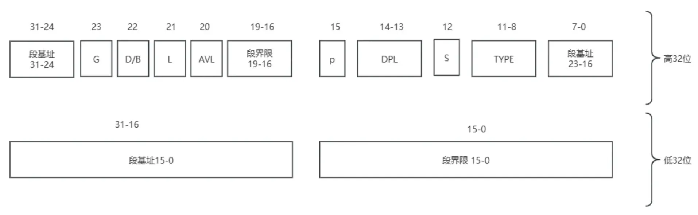

# 【Raymond-OS】Chapter 3. Protected Mode
认识段描述符，开启保护模式

<!-- more -->

::: info 
出于向前兼容，系统启动后会运行在 16 位的实模式下，需要手动开始 32 位进入保护模式，此过程包含固定步骤，但 gdt 表的构建相对繁琐
:::

## 一、过程分析
进入保护模式固定的几个步骤：
1. 开 A20 总线：实模式中地址线有 20 位，上古时代有些大哥会写地址回环的逻辑（地址对 20 位取模），冒然把地址线增加到 32 位会让有些历史逻辑报错，为了兼容就加了个开关，需要打开后才开启 32 位地址线
2. 加载 GDT：在分页之前，分段地址管理就是最先进的手段，保护模式当年就是以一手分段管理问世，GDT 表就是分段内存管理的配套信息，必须有它
3. 修改 CR0 标志位：就是修改标记位
4. 刷新流水线：流水线是 CPU 的一种机制，相当于多指令同时执行，指令是分 16 位译码和 32 位译码的，我们现在需要切换模式了，要确保之前的 16 位指令不会再产生影响，所以需要刷新流水线，而“长跳”是可触发流水线刷新的一种方式。
其中 1、3 和 4 部分代码相当于固定，他们的内容、背景无论你知道或不知道，代码都是一样的写法。第 2 部分加载 gdt 表则是本章的重点内容，gdt 表可以理解为一个数组，我们需要把数组的起始地址告诉操作系统，其中有几个 gdt 表项，即数组元素，是必需的，gdt 表项结构诡异，需要花些时间理解
## 二、核心内容
### 2.1 段描述符结构详解
实模式下的寻址是段寄存器左移 4 位之后与指令地址相加后获取实际物理地址，看似分段但其实没有段信息的维护，无法进行有效管理，于是在保护模式下有了 GDT 表。所谓的 GDT 表，可以理解为一个段描述信息数组，其中的表项被称为段描述符，每个段描述符固定 64 位，之前段寄存器中的数据会被解析成数组索引，于是在保护模式下，寻址会先通过段寄存器信息获取到段描述符，从描述符中获取段基址，段基址结合指令地址获取到真实地址。

短描述符结构如上，由于历史原因，其结构很混乱，段基址、段界限都需要自己拼（CPU 会有对应的缓存机制）。我们之后会开启分页，这里的分段模式只是一个必经的过渡阶段，以下是描述符各位的介绍
| 位数范围   | 名称                      | 描述                                       |
|------------|---------------------------|--------------------------------------------|
| 63-56      | Base Address 31:24        | 段基址的高 8 位                            |
| 55         | G (Granularity)           | 粒度位，0：字节为单位，1：4KB 为单位       |
| 54         | D/B (Default/Big)         | 默认操作数大小，0：16 位，1：32 位          |
| 53         | L (64-bit code segment)   | 64 位代码段标志，仅在 64 位模式下有效       |
| 52         | AVL                       | 系统软件可用位，通常未使用                 |
| 51-48      | Limit 19:16               | 段界限的高 4 位                            |
| 47         | P (Present)               | 段存在位，0：未存在，1：存在               |
| 46-45      | DPL (Descriptor Privilege Level) | 描述符特权级，0：最高，3：最低      |
| 44         | S (Descriptor type)       | 描述符类型，0：系统段，1：代码或数据段     |
| 43-40      | Type                      | 段类型，对于代码段和数据段有不同的含义     |
| 39-32      | Base Address 23:16        | 段基址的中 8 位                            |
| 31-16      | Base Address 15:0         | 段基址的低 16 位                           |
| 15-0       | Segment Limit 15:0        | 段界限的低 16 位                           |

### 2.2 构建 GDT 表
我们的构建 GDT 表，就是确定描述符，然后将数据写到固定位置。理论上段描述符是要配合分段机制来实现地址空间隔离，而实际上，通过段描述符的格式我们可以得知，段界限的 20 位配合粒度位，，我们也会将整个 2^20 * 4KB = 4GB 内存映射到一个段，而这就是所谓的平坦模型
根据约定，GDT 第一个描述符为空以避免歧义，此外我们需要一个数据段、一个代码段，这两个是必须要有的，以及我们需要一个显卡段来映射显卡内存。所以接下来就是结合描述符各位的信息，拼出每个段描述符的内容
#### 2.2.1 空描述符
空描述符只需各位都置零即可
```asm
GDT_BASE: dd 0x00000000, 0x00000000
```
#### 2.2.2 代码段描述符
因为我们采用平坦模型，所以段基址无疑全是 0，段界限全是 1，结合之前的描述可知低 32 位是 0x0000FFFF，接下来从左向右我们细看高 32 位
| 描述                               | 二进制表示                          |
|------------------------------------|-------------------------------------|
| 8 位段基址写 0                     | b00000000                           |
| 1 位 G 位颗粒度写 1               | b000000001                          |
| 1 位 D/B 位写 1 表示默认 16 位操作数 | b0000000011                         |
| 1 位 L 位写 0 不用管               | b00000000110                        |
| 1 位 AVL 位写 0 不用管             | b000000001100                       |
| 4 位段界限写 1                     | b0000000011001111                   |
| 1 位 P 位存在位写 1               | b00000000110011111                  |
| 2 位 DPL 写 0，表最高级           | b0000000011001111100                |
| 1 位 S 位写 1                     | b00000000110011111001               |
| 4 位 type 位写 1000               | b000000001100111110011000           |
| 8 位段基址写 0                     | b00000000110011111001100000000000   |

转成 16 进制就是 `0x00CF9800`
```asm
CODE_DESC: dd 0x0000FFFF, 0x00CF9800
```
#### 2.2.3 数据段描述符
低 32 位与代码段一致，高 32 位中，只有 type 位与代码段不一致，数据段的 4 位 type 位的值是 0010，所以最终数据段的高 32 位为：`b0000 0000 1100 1111 1001 0010 0000 0000`，十六进制为 `0x00CF9200`
```asm
DATA_STACK_DESC: dd 0x0000FFFF, 0x00CF9200
```
#### 2.2.4 显存段描述符
因为我们只需要在显示器上输出文本，所有我们直接把显存段映射到实模式下文本模式显示适配器缓存的地址空间（参见第一章实模式下内存布局），其起始地址为 0xB8000，结束地址为 0xBFFFF，我们以 4KB 为粒度的话，可以得到描述符中段界限为 7，所以显存段的低 32 位为 `0x80000007`。
而再次使用之前的方法，我们可以得到其高 32 位为 `00000000110000001001001000001011b`，即 `0x00C0920B`
```asm
VIDEO_DESC: dd 0x80000007, 0x00C0920B
```
#### 2.2.5 GDT 表总览
构建 gdt 表听起来抽象，但是实际上就是我们刚刚写的 4 行代码，如下所示，其中 EMPTY_DESC、CODE_DESC等 tag 会在机器码生成后被消除，dd 是汇编定义双字的指令，所以下面四行代码其实是表示了 64b*4 的一块内存空间，这就是我们的 gdt 表，而且 EMPTY_DESC这第一个 tag 就可以拿到我们 gdt 这块内存空间的起始地址
```asm
; 这里其实就是GDT的起始地址，第一个描述符为空
EMPTY_DESC: dd 0x00000000, 0x00000000
; 代码段描述符，一个dd为4字节，段描述符为8字节，先定义低32位，再定义高32位
CODE_DESC: dd 0x0000FFFF, 0x00CF9800
; 栈段描述符，和数据段共用
DATA_STACK_DESC: dd 0x0000FFFF, 0x00CF9200
; 显卡段，非平坦
VIDEO_DESC: dd 0x80000007, 0x00C0920B
```
### 2.3 加载 GDT 表
加载 GDT 表需要使用 lgdt命令，它需要GDT_BASE 和 GDT_LIMIT 信息：
- GDT_BASE 是 GDT 在内存中的起始地址。
- GDT_LIMIT 是 GDT 的大小减去 1，表示 GDT 的限制（类比数组偏移）。
```asm
GDT_SIZE equ $ - GDT_BASE
GDT_LIMIT equ GDT_SIZE - 1

gdt_ptr dw GDT_LIMIT
        dd GDT_BASE
```

### 2.4 构建段选择子
在实模式中，段寄存器值左移四位后与指令、数据地址相加便得到真实地址，而在保护模式中，段寄存器中记录的主要是段描述符的偏移量，而段寄存器中的数据也有了新的名字叫段选择子，段选择子包括偏移量、TI 和 RPL，其中 TI 为 1 表示此为 LDT，为 0 则表示 GDT；RPL 表示特权级，值 0 为最高级，值 3 为最低级
```shell
15      3  2  1  0
+--------+--+--+--+
| Index  |TI|RPL|
+--------+--+--+--+
```
于是，我们的三个描述符对应的选择子分别为：
```asm
SELECTOR_CODE equ  0000000000001000b
SELECTOR_DATA equ  0000000000010000b
SELECTOR_VIDEO equ 0000000000011000b
```
### 2.5 开启保护模式
经过上述前提铺垫后，进入保护模式的代码简单如下。其中需要注意的是，CPU 的流水线工作模型导致我们在进入保护模式时还有部分实模式的 16 位指令在进行中，为了避免产生预期之外的情况，我们需要刷新流水线，而刷新流水线的方式可使用长跳，即代码中 jmp dword SELECTOR_CODE:p_mode_start，其中 p_mode_start其实就是我们在保护模式运行的一段测试代码
```asm
loader_start: 
    ; 打开A20地址线
    in al, 0x92
    or al, 00000010B
    out 0x92, al

    ; 加载gdt
    lgdt [gdt_ptr]

    ; cr0第0位置1
    mov eax, cr0
    or eax, 0x00000001
    mov cr0, eax

    ; 刷新流水线
    jmp dword SELECTOR_CODE:p_mode_start
```